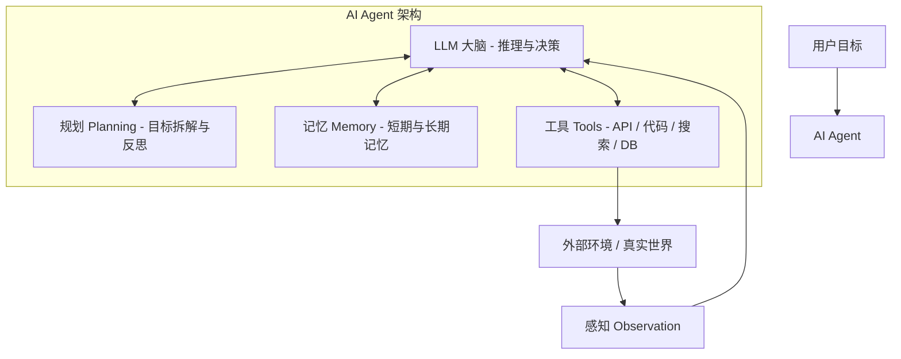

# 01-What-is-an-Agent: 什么是 AI Agent？核心架构拆解

在了解了大语言模型（LLM）的基础后，本章将深入解析：**到底什么是 AI Agent（人工智能体）？它的内部逻辑与四大核心组件是如何工作的？**

---

## 1. 什么是 AI Agent？

> 💡 **AI Agent 经典公式**：  
> **AI Agent** = **LLM (大脑)** + **Perception (感知)** + **Planning (规划)** + **Memory (记忆)** + **Tool Use (工具使用)**

* **传统的 Chatbot**：你输入文本 → LLM 生成文本 → 结束（被动交互）。
* **AI Agent**：给予一个高层目标（如：“帮我调研最新的 Agent 框架并写一份对比报告”） → Agent 自主规划步骤 → 搜索网络 → 读取网页 → 提取分析 → 遇到报错自主修正 → 交付最终结果（自主闭环）。

---

## 2. Agent 的四大核心支柱 (Core Components)



### 2.1 🧠 大脑 (Brain / Core Reasoning Engine)
LLM 是 Agent 的中心引擎。它负责：
- 理解人类的自然语言指令；
- 根据当前状态（Observation）生成下一步决策（Thought & Action）；
- 评估任务是否已完成。

### 2.2 📋 规划 (Planning)
面对复杂任务，Agent 不能盲目执行，需要具备“思考”与“拆解”的能力。
* **目标拆解 (Subgoal Decomposition)**：把大目标拆分为若干个可执行的子任务（例如：先查 API 接口 → 再写代码 → 最后运行测试）。
* **ReAct 范式 (Reasoning + Acting)**：
  - **Thought (思考)**：我接下来应该做什么？
  - **Action (行动)**：调用什么工具并传入什么参数？
  - **Observation (观察)**：工具返回了什么结果？
* **反思与自我修正 (Reflexion / Self-Correction)**：在遇到代码报错或工具执行失败时，分析原因并重新规划行动方案。

### 2.3 💾 记忆 (Memory)
记忆机制让 Agent 能够保持上下文连贯并积累经验。
* **短期记忆 (Short-Term Memory)**：利用上下文窗口（Context Window），保留最近几轮的对话历史与思考轨迹（In-context Learning）。
* **长期记忆 (Long-Term Memory)**：利用外部存储（如向量数据库 Vector DB、Key-Value 库、文件系统），存储过去的知识、历史用户偏好和经验法则。

### 2.4 🛠️ 工具使用 (Tool Use / Function Calling)
Agent 超越传统 LLM 的关键在于**能够与物理世界或数字化环境发生交互**。
* **常用工具类型**：
  - 搜索引擎（Brave Search / Google API / DuckDuckGo）
  - 代码解释器（Python REPL / Terminal / Shell）
  - 数据库与 API（SQL / HTTP 请求 / REST API）
  - 文件系统读写（View, Edit, Write File）

---

## 3. ReAct 模式全景推演

ReAct (Yao et al., 2022) 是目前最经典的 Agent 工作模式。其运行闭环如下：

```text
[用户输入] 帮我查一下今天上海的天气，并推荐适合穿的衣服。
   │
   ▼
【Thought 1】用户想知道今天上海的天气，我需要先使用天气查询工具获取实况数据。
【Action 1】get_weather(city="上海", date="today")
   │
   ▼ (执行工具)
【Observation 1】{"city": "上海", "temp": "15°C", "condition": "小雨", "wind": "3级"}
   │
   ▼
【Thought 2】获取到了天气：15°C 小雨。温度较低且有雨，需要推荐保暖且防水/带伞的穿搭。
【Action 2】Final Answer: 今天上海温度约为 15°C，伴有小雨。建议穿风衣或轻便羽绒服，并随身携带雨伞。
```

---

## 4. 小结

Agent 的本质是：**利用 LLM 的通用推理能力作为引擎，结合规划、记忆与工具，在环境中进行“观察 - 思考 - 行动 - 反思”的自主循环。**

👉 下一步请阅读：
- [03-Frameworks-and-Tools/README.md](file:///c:/Haven-AI/03-Frameworks-and-Tools/README.md)（认识开发 Agent 的工具箱）
- [04-Projects/README.md](file:///c:/Haven-AI/04-Projects/README.md)（准备开始手撕第一个 ReAct Agent）
