# 02-Chatbot vs Workflow vs Agent vs Multi-Agent 核心区别解析

在 AI 领域，**Chatbot（聊天机器人）**、**Workflow（工作流）**、**Agent（单智能体）** 和 **Multi-Agent（多智能体）** 是四个容易混淆的核心概念。

理解它们的本质区别与演化路径，是掌握 AI 应用架构设计的基础。

---

## 1. 一图胜千言：四大模式架构对比

```mermaid
flowchart TD
    subgraph SG1 ["1. Chatbot (聊天机器人)"]
        C_User[用户] <-->|直接对话| C_LLM[LLM]
    end

    subgraph SG2 ["2. Workflow (工作流)"]
        W_User[用户] --> W_Node1[节点1: 读取数据]
        W_Node1 --> W_LLM[节点2: LLM 总结/提取]
        W_LLM --> W_Cond{条件分支 If/Else}
        W_Cond -->|Condition A| W_Node3A[节点3A: 发送邮件]
        W_Cond -->|Condition B| W_Node3B[节点3B: 存入数据库]
    end

    subgraph SG3 ["3. Agent (单智能体)"]
        A_User[用户目标] --> A_Brain[LLM 大脑]
        A_Brain <-->|自主循环| A_Loop{ReAct 决策}
        A_Loop <-->|思考/调用| A_Tools[工具集: 搜索/代码/DB]
        A_Loop -->|自我修正| A_Brain
        A_Loop -->|达成目标| A_Out[交付最终结果]
    end

    subgraph SG4 ["4. Multi-Agent (多智能体)"]
        M_User[用户目标] --> M_Leader[Leader / Manager Agent]
        M_Leader <-->|分派任务| M_Worker1[Agent A: 调研员]
        M_Leader <-->|分派任务| M_Worker2[Agent B: 程序员]
        M_Leader <-->|分派任务| M_Worker3[Agent C: 测试员]
        M_Worker1 <-->|消息传递/协同| M_Worker2
        M_Worker2 <-->|代码交付与找茬| M_Worker3
    end
```



---

## 2. 通俗比喻：从“前台”到“现代化公司”

我们可以用**一家公司的运作**来形象地理解：

| 模式 | 通俗比喻 | 现实场景说明 |
| :--- | :--- | :--- |
| **Chatbot** | **前台接待员** | 问一句答一句。你问“公司地址在哪？”，它查内部资料回答你。你如果让它“帮我把公司全年的财务报表做出来并打印”，它做不到。 |
| **Workflow** | **自动化工厂流水线** | 流程提前被硬编码固定（第 1 步放零件 → 第 2 步机械臂焊接 → 第 3 步喷漆）。LLM 在这里只是流水线上的某个螺丝钉（比如仅负责翻译或提取文字）。 |
| **Agent** | **全能项目经理 (PM)** | 你只给它一个目标：“把竞品的最新功能调研清楚写一份报告”。它自己决定先上网搜资料，发现网页被挡了就换搜索词，拿到数据后整理出报告。 |
| **Multi-Agent** | **包含多个部门的跨功能团队** | 一个 PM 搞不定大型软件开发，于是组建团队：CEO（拆解任务）、架构师（设计系统）、程序员（写代码）、测试员（跑测试找 Bug）、主编（写文档）。大家协作完成项目。 |

---

## 3. 维度深剖：四大模式核心区别表

| 维度 | Chatbot (聊天机器人) | Workflow (工作流) | Agent (单智能体) | Multi-Agent (多智能体) |
| :--- | :--- | :--- | :--- | :--- |
| **核心驱动力** | 用户输入驱动 | 人类预设逻辑 (DAG) | LLM 自主决策循环 (ReAct) | 智能体角色分工与消息机制 |
| **自主性 (Autonomy)** | ❌ 无 (被动响应) | ⚠️ 极低 (固定路径) | ⚡ 高 (自主规划与选择工具) | 🚀 极高 (分布式/群体智能) |
| **确定性 (Determinism)**| 高 (一问一答) | 100% 确定 (路线固定) | 低 (路径由模型实时推理生成) | 较低 (涌现性与复杂博弈) |
| **工具使用能力** | ❌ 无或仅限写死插件 | ⚠️ 节点硬编码调用 | ✅ 动态选择并解析工具 | ✅ 多 Agent 各持专用工具库 |
| **主要控制权** | 用户 | 开发者 (Hardcoded) | LLM 模型本身 | 编排协议与团队规则 |
| **适用场景** | 咨询、答疑、知识库检索 | 格式标准化、高稳定性要求的流程 | 逻辑复杂、路径不确定的探索性任务 | 大型工程、软件开发、复杂研报 |

---

## 4. 详细拆解

### 4.1 Chatbot（聊天机器人）
* **特征**：单次或多轮问答对话框。
* **局限性**：缺乏“行动能力”和“外部环境感知”。它只能给出文本建议，无法直接帮你去真实世界中执行操作。

### 4.2 Workflow（工作流）
* **特征**：用有向无环图 (DAG) 严格控制路线。格式为 `If A, then B; else C`。
* **优点**：**极度稳定、可预测、成本可控**。适合财务报销审批、标准化数据清洗。
* **局限性**：无法应对规则之外的突发状况。一旦遇到未定义的错误，整个流水线即告崩溃。

### 4.3 Agent（单智能体）
* **特征**：拥有“思考 - 行动 - 观察 - 反思 (ReAct)”循环。
* **核心突破**：从“人类告诉系统怎么做 (How-to)”升级为“人类只告诉系统要什么结果 (Goal-oriented)”。
* **局限性**：单 Agent 在任务过于繁重时，容易出现**上下文溢出（Context Drift）**、注意力分散和自我怀疑死循环。

### 4.4 Multi-Agent（多智能体）
* **特征**：将复杂大任务解耦（Decoupling），分配给多个具备专长（System Prompt + 专属 Tools）的 Agent。
* **核心机制**：
  1. **层级模式 (Manager-Worker)**：由主 Agent 统一分配任务、审核子 Agent 的结果。
  2. **协作/对抗模式 (Peer-to-Peer / Debate)**：Agent 之间互相评测、提出修改意见（例如：Coder Agent 写代码，Reviewer Agent 提出 Bug，Coder 再修正）。
* **优势**：极大地提升复杂工程场景下的准确率与鲁棒性。

---

## 5. 架构选择指南：开发时该选哪种？

```text
遇到业务需求时：
 ├── 是否只需要问答或文本生成？
 │    └── YES ──> 选择 Chatbot
 ├── 步骤是否完全固定，要求 100% 稳定且不可改变？
 │    └── YES ──> 选择 Workflow
 ├── 路径不确定，需要自主查资料、调 API、自我修正报错？
 │    └── YES ──> 选择 Single Agent
 └── 任务极为复杂（如做一套完整系统/长篇研报），单 Agent 容易混淆上下文？
      └── YES ──> 选择 Multi-Agent
```

---

*文件归档：`c:\Haven-AI\02-Agent-Architecture\02-Chatbot-vs-Workflow-vs-Agent-vs-MultiAgent.md`*
