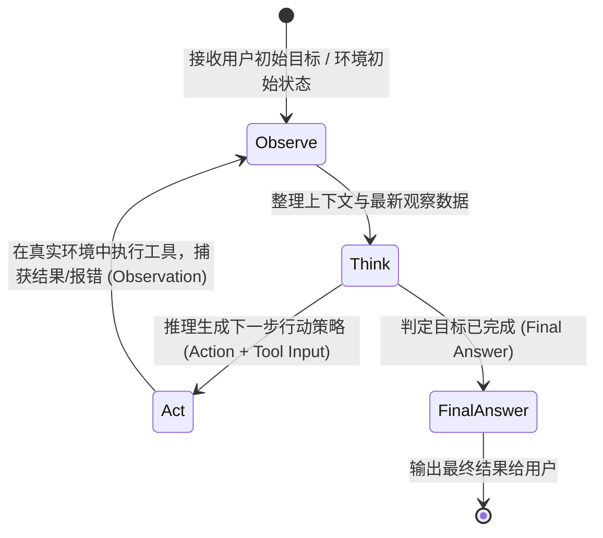
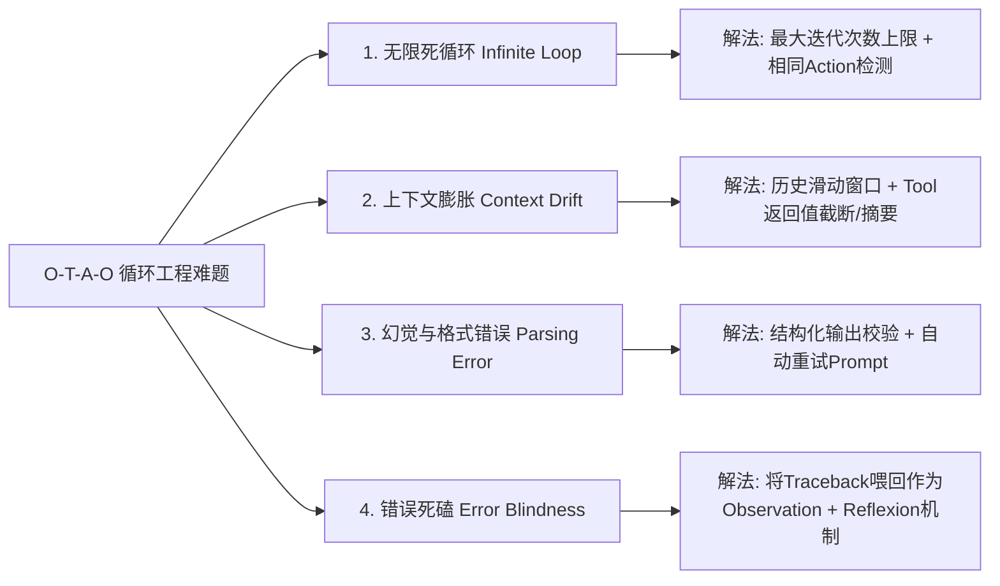

# 03-Agent 核心自主循环：Observe -> Think -> Act -> Observe 全景拆解

AI Agent 与传统概率文本模型（LLM）的**界河**，就在于是否拥有一个可持续运转的**自主控制循环（Autonomous Control Loop）**。

这个循环最经典的形式就是：**Observe（感知/观察） → Think（思考/推理） → Act（行动/执行） → Observe（再观察/反馈闭环）**。

---

## 1. 为什么需要 O-T-A-O 闭环？

### 1.1 无闭环的 LLM（单次开环）
传统的 Chatbot 只是一个单次映射：  
> `Prompt` → `LLM` → `Response`
LLM 只能根据当前已有的静态知识预测下一个 Token。如果发现代码写错了、接口调不通或检索到的文档不全面，它**无法自发地修正或重试**。

### 1.2 拥有 O-T-A-O 闭环的 Agent
Agent 引入了控制论中的 **OODA 循环 (Observe-Orient-Decide-Act)** 和 AI 领域的 **ReAct 范式**，构成了一个带反馈调节的闭环系统：



---

## 2. 四大阶段深度剖析 (Phase Deep Dive)

### 2.1 👁️ 阶段一：Observe（感知 / 观察）
* **定义**：Agent 收集、接收并结构化“外部环境”及“工具执行结果”的过程。
* **感知来源包含**：
  1. **用户输入 (User Goal)**：初始的任务指令。
  2. **工具返回值 (Tool Execution Output)**：API 返回的 JSON、Shell 命令的 stdout/stderr、SQL 查询结果、网页 HTML 等。
  3. **记忆检索结果 (Memory Retrieval)**：从向量数据库中召回的相关历史片段。
  4. **环境状态 (Environment State)**：文件目录变化、系统时间、网络连接状态。
* **工程处理**：
  - 对过长的 Observation 进行截断 (Truncation) 或摘要，防止 Context Window 溢出。
  - 清洗包含敏感信息或控制字符的原始输出。

### 2.2 🧠 阶段二：Think（思考 / 推理）
* **定义**：LLM 大脑结合当前的 Observation，运用思维链（Chain-of-Thought）进行推理分析。
* **思考过程包含**：
  1. **状态评估 (State Evaluation)**：上一步的 Action 成功了吗？目前距离最终目标还差什么？
  2. **规划与拆解 (Planning & Routing)**：为了解决剩下的问题，下一步应该调用哪个工具？参数应该传什么？
  3. **反思 (Self-Reflection)**：如果上一步出错了（比如 API 报 404 或 Python 报 SyntaxError），分析报错原因并思考替代方案。
* **输出控制**：
  - 通过 Prompt 约束，强制 LLM 显式写出 `Thought: ...` 字段（增强可解释性），然后给出明确的 `Action`。

### 2.3 ⚡ 阶段三：Act（行动 / 执行）
* **定义**：Agent 退出单纯的“思考状态”，向外部世界触发一个具体的物理/数字化操作。
* **常见 Action 类型**：
  - **Tool Call**：调用外部 API（如 getWeather, searchGoogle, runPythonCode）。
  - **Environment Mutation**：在文件系统中创建/编辑文件、发送邮件、修改数据库记录。
  - **Memory Write**：将重要经验或中间变量写入长期记忆。
* **关键控制机制**：
  - **Schema 校验**：在把 Action 发送给系统执行前，使用 Pydantic 或 JSON Schema 校验工具参数合法性。
  - **安全防护 (Guardrails / Human-in-the-Loop)**：对危险操作（如删除数据库、运行 `rm -rf`）提示人工介入审批。

### 2.4 🔄 阶段四：Observe（再观察 / 结果反馈闭环）
* **定义**：Agent 捕获 Action 执行后的真实环境改变，并将其包装为下一次思考的输入。
* **闭环上下文递推**：  
> `Context_{t+1} = Context_t + Thought_t + Action_t + Observation_t`
  每一次 Action 的结果（不管是成功还是报错），都会被重新喂回给 LLM 大脑。LLM 看到这个新的 Observation 后，再次进入 **Think** 阶段，从而形成了**自适应的连续循环**。

---

## 3. 完整真实 Trace 推演（以自动查天气并生成报告为例）

用户目标：**“查一下今天上海的天气，如果有雨就把穿搭建议写入到 `weather_advice.txt` 中。”**

```text
======================= 循环 01 (Loop 01) =======================
【Observe 01】(初始状态)
  User Goal: "查一下今天上海的天气，如果有雨就把穿搭建议写入到 weather_advice.txt 中。"
  Available Tools: [get_weather, write_file]

【Think 01】
  用户需要知道今天上海的天气，我应该先使用 get_weather 工具查询上海实况天气。
  
【Act 01】
  Action: get_weather
  Action Input: {"city": "上海", "date": "today"}

======================= 循环 02 (Loop 02) =======================
【Observe 02】(工具执行结果)
  Observation: {"city": "上海", "temperature": "14°C", "condition": "小雨", "humidity": "85%"}

【Think 02】
  观察到上海今天有“小雨”，温度 14°C。满足“如果有雨”的条件。
  我需要生成一份穿搭建议（建议穿防水风衣，带伞），并调用 write_file 工具保存为 weather_advice.txt。

【Act 02】
  Action: write_file
  Action Input: {
    "filename": "weather_advice.txt",
    "content": "上海今日天气：14°C 小雨。\n建议：携带雨伞，穿防风防水外套或轻便风衣，注意保暖。"
  }

======================= 循环 03 (Loop 03) =======================
【Observe 03】(工具执行结果)
  Observation: "File weather_advice.txt written successfully (bytes: 112)."

【Think 03】
  文件已成功写入。目标要求完成（查询天气 + 写入建议），不需要再调用工具。

【Act 03】
  Final Answer: "已为您查询到上海今天为 14°C 小雨，并成功将带伞及防风防水的穿搭建议保存至 weather_advice.txt。"
```

---

## 4. 工业级 Agent 循环四大核心挑战与应对策略

在实际工程落地中，朴素的 O-T-A-O 循环会面临以下四大死穴，必须设计应对机制：



### 4.1 🔴 问题一：无限死循环 (Infinite Loop)
* **现象**：Agent 陷入了反复调用同一个工具（如不断重复搜索相同的关键字）的怪圈。
* **防护策略**：
  1. **硬性计数器 (Max Iterations)**：设置全局最大循环次数（如 `max_iterations=10`），超时强制退出并返回兜底结果。
  2. **重复 Action 校验**：如果连续 3 次输出了完全相同的 `Action` 和 `Action Input`，主动触发系统干预 Prompt：“你已经多次重复该动作，请换一种思路或工具”。

### 4.2 🟠 问题二：上下文膨胀 (Context Expansion & Drift)
* **现象**：随着循环轮次增加（第 10 轮、第 20 轮），所有的 Observation 不断追加，导致 Token 消耗激增、时延变长，模型甚至会混淆最初的目标。
* **防护策略**：
  1. **Observation 裁剪**：对于大文本 Observation（如抓取的网页 HTML），仅保留前 1000 字符或使用轻量模型先提炼摘要。
  2. **消息压缩 (Sliding Window / Memory Summarization)**：隔一定轮次将早期的 Think-Act 过程压缩为系统摘要。

### 4.3 🟡 问题三：解析错误与工具幻觉 (Parsing & Tool Hallucination)
* **现象**：LLM 生成了不合法的 JSON，或者调用了根本不存在的工具名。
* **防护策略**：
  1. **自动重试机制 (OutputParser Retry)**：当捕获到 JSON 代码块解析失败时，直接构造一个错误 Observation：`"Observation: Failed to parse your action JSON. Error: Expecting property name enclosed in double quotes. Please re-generate valid JSON."`，让 LLM 在下一个 Think 阶段自我修复。

### 4.4 🟢 问题四：报错死磕 (Error Recovery / Reflexion)
* **现象**：代码运行报错后，Agent 不知道调整思路，只是一味地原样重跑。
* **防护策略**：
  1. **引入 Reflexion（反思）节点**：当捕捉到 Exception 时，不只返回原始报错，还要附带反思引导：“报错为 ModuleNotFoundError，请检查是否需要先安装依赖，或者更换标准库中的替代模块”。

---

## 5. 小结

* **O-T-A-O 循环** 是 Agent 的**灵魂机制**。
* **Observe** 是输入，**Think** 是大脑推理，**Act** 是输出执行，**再 Observe** 是反馈反馈，四者交织形成了动态的智能涌现。
* 真正的工程实现中，**对循环的边界控制（防死循环、容错处理、上下文压缩）** 决定了一个 Agent 系统的稳定与优劣。

👉 下一步推荐：进入 [04-Projects/README.md](file:///c:/Haven-AI/04-Projects/README.md)，在 **Lab 01** 中使用纯 Python 手写一套带死循环检测与报错重试的 O-T-A-O 代码脚本！
