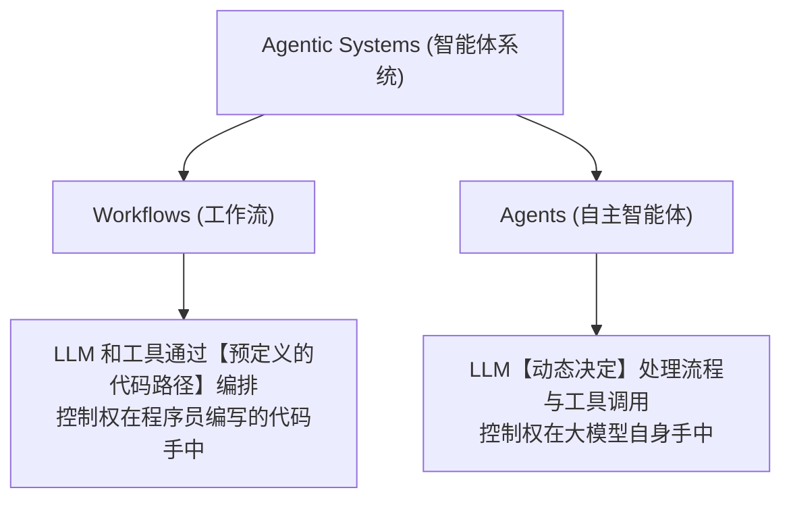
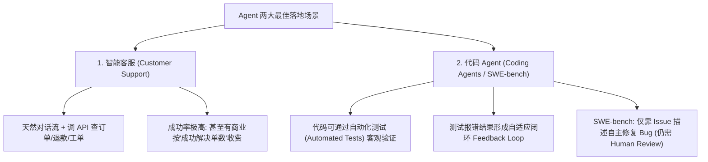
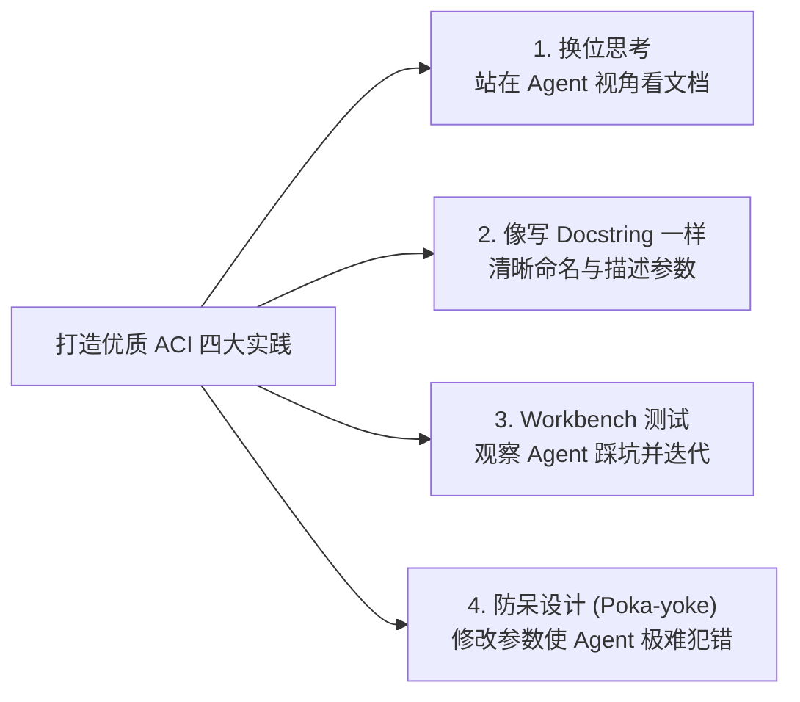

# 05-Anthropic 官方指南：构建高效 AI Agent (Building Effective Agents) 归纳总结

> **出处**：Anthropic 官方工程实践指南 (*Building Effective Agents*, Published Dec 19, 2024 by Erik S. & Barry Zhang)  
> **核心结论**：在生产环境中，**最成功的 AI 应用并非使用了最复杂的框架，而是采用了极简、可组合的设计模式 (Simple, Composable Patterns)**。增加复杂度的唯一理由，是它能带来**可测量的效果提升**。

---

## 1. 概念重塑：Workflows vs. Agents 的本质区别

Anthropic 官方将包含 LLM 的自动化系统统称为 **Agentic Systems (智能体系统)**，但明确划清了架构上的界限：



| 维度 | Workflows (工作流) | Agents (自主智能体) |
| :--- | :--- | :--- |
| **控制权** | **人类代码** (预定义 DAG 图 / 硬编码) | **LLM 大脑** (自适应推理循环) |
| **路径确定性** | 100% 确定或有限分支 | 路径动态生成，步骤不可预知 |
| **适用场景** | 目标明确、步骤可拆解的标准化任务 | 开放式问题（如软件 Bug 修复、复杂调研） |
| **权衡 (Trade-Off)** | 高确定性、低时延、低成本 | 高灵活性、耗费 Token、需容错防死循环 |

---

## 2. 五大黄金架构模式 (Design Patterns)

Anthropic 总结了在生产环境中最常见且极其高效的五种递进式设计模式：

### 基础构建块：Augmented LLM (增强大模型)
最底层的单次 LLM 调用，通过结合 **Retrieval (RAG 检索)**、**Tools (工具调用)** 和 **Memory (记忆)** 增强能力。这是所有复杂模式的基本单元。


---

### 模式一：Prompt Chaining (提示词链)
将大任务分解为固定的**顺序链条**，每一步 LLM 的输出作为下一个 LLM 的输入，中间可以插入代码级的校验开关（Gate）。


* **适用场景**：可清晰拆解为固定步骤的任务（如：生成营销文案 → 翻译为多国语言；生成大纲 → 检查大纲 → 撰写全文）。

---

### 模式二：Routing (路由)
利用 LLM 或传统分类器对输入进行分类，并将其重定向到专门的下游处理节点或定制提示词中。


* **适用场景**：输入类型多样且需要“关注点分离”的场景。既能分发任务，又能优化成本（简单问题用小模型，难题用大模型）。

---

### 模式三：Parallelization (并行化)
让多个 LLM 实例同时工作，并由代码汇总结果。主要分为两种变体：


1. **Sectioning (分段)**：将大任务拆分为互不依赖的子任务并行处理（如：一个模型生成回复，另一个模型同时跑安全护栏拦截）。
2. **Voting (投票)**：多次运行同一任务以获取多样化结果（如：多个 Prompt 同时审查代码漏洞，只要有一个报风险就拦截）。

---

### 模式四：Orchestrator-Workers (主控-工作者)
由一个主控 LLM (Orchestrator) **动态拆解**任务，分发给多个子 LLM (Worker) 执行，最后汇总结果。


* **与并行化的区别**：子任务的**数量与内容不是预先写死的**，而是由主控 LLM 根据实际输入动态决定的（极适合跨多个文件的代码重构、多源信息检索）。

---

### 模式五：Evaluator-Optimizer (评估者-优化者)
由一个 LLM 生成回复，另一个 LLM 进行评估和反馈，形成**自我修正的迭代双闭环**。


* **适用场景**：具有明确评估标准且通过反复润色能显著提升质量的任务（如：文学翻译、复杂推导代码测试）。

---

## 3. 官方三大核心工程原则 (Core Principles)

根据 Anthropic 在构建 Agent（如 SWE-bench 自动写代码智能体、Computer Use 电脑操作智能体）的经验，提出了三条黄金原则：

### 原则一：保持设计简单 (Maintain Simplicity)
* **不要过度抽象**：开源框架（如 LangChain 等）虽然上手快，但过多的抽象层会掩盖真实的 Prompt 和回复，增加 Debug 难度。
* **从基础 API 开始**：优先使用原生的 LLM API 构建简单模式。仅在能带来**可测量效益**时才增加系统复杂度。

### 原则二：保持透明度 (Prioritize Transparency)
* 显式记录并展示 Agent 的规划步骤、工具调用日志与思考过程。不仅方便开发者排查 Bug，也能增强用户对 Agent 的信任。

### 原则三：精心打造 ACI (Agent-Computer Interface)
* **把工具当作接口设计**：人类需要好的 HCI (Human-Computer Interface)，Agent 需要好的 ACI (Agent-Computer Interface)。
* **防呆设计 (Poka-yoke)**：
  - 给工具编写极度清晰的文档说明、边界条件和使用示例（就像给初级程序员写高质量的 Docstring）。
  - 避免模糊参数。例如 Anthropic 发现 Agent 使用相对路径容易迷路，改为**强制要求绝对路径**后，Agent 错误率直接降为零。

---

## 4. 附录一：Agent 的两大最佳实操落地方向 (Agents in Practice)

Anthropic 官方指出，Agent 目前在两个领域的应用最为成熟，且充分体现了“对话 + 行动 + 闭环反馈 + 人类监督”的价值：



### 🎧 A. 智能客服 Agent (Customer Support)
* **天然匹配原因**：客服场景既需要自然对话，又需要访问外部系统执行具体动作。
* **主要能力**：
  - 调用工具拉取客户数据、历史订单、知识库文章。
  - 程序化自动触发**退款、重发货物、更新工单状态**。
  - 成功标准极其明确（用户问题是否被解决）。

### 💻 B. 软件开发代码 Agent (Coding Agents)
* **天然匹配原因**：软件开发是目前 LLM 展现出最大潜力的领域，已从“代码补全”进化到“自主解决真实 GitHub Issue”。
* **为什么代码场景最适合 Agent**：
  1. **客观可验证 (Verifiable)**：代码写得对不对，可以通过单元测试 (Unit Test) 客观判定。
  2. **闭环反馈 (Feedback Loops)**：测试用例返回的 Traceback 报错信息可以直接作为 Agent 下一轮思考的输入。
  3. **结构明确**：文件、函数、语法规则高度规范。
* **人机协同警示**：虽然自动化测试能验证功能正确性，但**人类 Code Review 依然不可或缺**，用以确保代码符合整体系统架构要求。

---

## 5. 附录二：工具提示词工程与 ACI 设计 (Prompt Engineering Your Tools)

Anthropic 强调：**无论你构建什么 Agent，工具 (Tools) 都是核心。设计工具定义 (Tool Definitions) 所花的时间和 Prompt 工程精力，应该与 System Prompt 同等重要！**

在 SWE-bench 项目中，Anthropic 团队**在工具优化上花费的时间甚至超过了优化主 Prompt**。

---

### 🎨 1. 选择正确的工具格式 (Format Selection)

同一种操作有多种表达方式（例如：写代码可以用 Diff 补丁，也可以重写整份文件；结构化输出可以用 JSON，也可以用 Markdown 代码块）。

LLM 编写某些格式的门槛远高于其他格式：
* ❌ **反面教材（高 Overhead 格式）**：
  - 写 **Git Diff** 必须要模型在写代码前精准计算 Chunk Header 里的变更行数，极易算错。
  - 在 **JSON** 内嵌入代码需要对换行符 `\n` 和双引号 `\"` 进行繁琐的转义。
* ✅ **最佳实践三大法则**：
  1. **给模型留足思考 Token**：让模型在给出最终代码前先思考（Thought），避免“一口气写死”。
  2. **贴近互联网天然文本**：格式越接近互联网常见的自然文本越好（如 Markdown 代码块比 JSON 字符串更天然）。
  3. **零格式负担 (No Formatting Overhead)**：不要让模型去手动计算几千行代码的准确行号。

---

### 🛡️ 2. 打造优秀的 ACI (Agent-Computer Interface) 四大实践

就像对待人类的 **HCI (人机交互界面)** 一样，开发者必须投入同等精力去设计 Agent 的 **ACI (Agent-计算机接口)**：



1. **站在 Agent 的视角换位思考 (Put yourself in model's shoes)**：
   - 看看工具说明是否足够清晰。好的工具定义必须包含：**示例用法 (Examples)、边界条件 (Edge Cases)、输入格式要求、与其他相似工具的明确界限**。
2. **像给初级程序员写 Docstring 一样命名和描述**：
   - 精确命名参数名，特别是存在多个相似工具时，消除所有歧义。
3. **大量测试并观察模型犯错 (Test & Iterate)**：
   - 在控制台中用大量样本运行，专门观察 Agent 会在哪一步理解错参数，针对性重写 Tool Description。
4. **防呆设计 (Poka-yoke)**：
   - 重构工具参数，从根源上让 Agent **想犯错都犯不了**。
   - 🌟 **Anthropic SWE-bench 经典案例**：团队发现 Agent 在离开项目根目录后，使用相对路径 (`../foo/bar.py`) 极易出错。他们直接将工具修改为**强制要求使用绝对路径 (Absolute Filepaths)**，结果 Agent 的路径错误率**瞬间降为 0**！

---

## 6. 总结与借鉴

```text
生产级 Agent 落地法则：
 1. 优先使用简单的 Prompt + 检索 + 工具 (Augmented LLM)
 2. 能用 Workflow 解决的，绝不交给自主 Agent
 3. 只有遇到开放式、路径不可预测的问题，才引入 Agent 动态循环
 4. 重点投入 ACI (工具 Prompt 与接口) 的优化，收益远大于修改全局 Prompt
 5. 将相对路径改为绝对路径等防呆设计 (Poka-yoke)，能带来质的稳定提升
```

---

*文件归档：[c:\Haven-AI\02-Agent-Architecture\05-Anthropic-Building-Effective-Agents.md](file:///c:/Haven-AI/02-Agent-Architecture/05-Anthropic-Building-Effective-Agents.md)*
