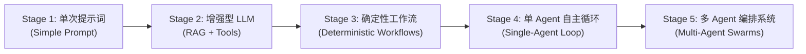
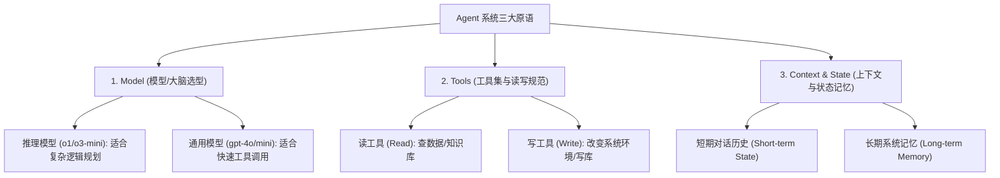
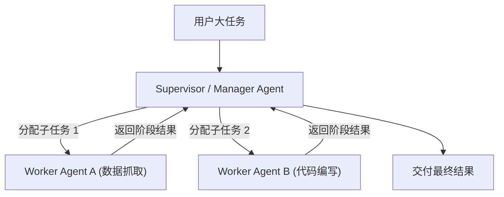
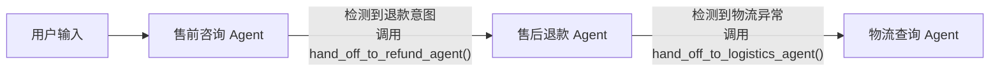

# 06-OpenAI 官方指南：构建 AI Agent 实用指南 (A Practical Guide to Building Agents) 归纳总结

> **出处**：OpenAI 官方白皮书 (*A Practical Guide to Building Agents*, OpenAI 2025 年发布，约 34 页)  
> **核心宗旨**：指导产品经理与工程团队**从简单的 Chatbot 跨越到可落地的工业级 Agent 系统**。白皮书强调：**复杂度是需要被妥善管理的成本，而不是追求的特质 (Complexity is a cost to be managed, not a feature)**。

---

## 1. 核心定义与演进阶梯 (5-Stage Evolution)

OpenAI 将智能体系统的演进划分为了明确的 5 级阶梯：



* **Agent 的本质标志**：具备**自主控制循环 (LLM-driven Control Loop)**，能够根据环境反馈（Observation）自发决定工具选择、调整执行路径并完成失败重试（Failure Recovery），而不需要人类每一步硬编码指令。

---

## 2. Agent 系统三大核心原语 (The 3 Core Primitives)

OpenAI 提出，构建任意生产级 Agent 系统都离不开以下三大基础元素（Primitives）：



### 原语 1：Model（模型选型策略）
* **推理型模型 (Reasoning Models, 如 o1 / o3-mini)**：擅长深度思考、复杂数学推导、多步骤逻辑规划。
* **通用非推理模型 (Non-reasoning Models, 如 gpt-4o / gpt-4o-mini)**：擅长标准工具调用、快速文本分类、低延迟对话。
* **策略**：在多 Agent 系统中，不同节点匹配不同模型，平衡成本与延迟。

### 原语 2：Tools（工具集规范）
* **读写分离 (Read vs. Write Tools)**：查询类只读工具权限完全开放；修改数据库、发送邮件、调资金接口的“写工具”需要加锁与审计。
* **消除歧义**：工具名称与描述必须要像给人类写 API 文档一样清晰，避免大模型混淆。

### 原语 3：Context & State（上下文与状态管理）
* **防止上下文漂移 (Context Drift)**：随着循环轮次增加，多余信息会导致 Token 成本飙升。
* **状态压缩技术**：使用滑动窗口 (Sliding Window)、历史消息摘要 (Summarization) 和键值存储 (Key-Value Store) 隔离无关信息。

---

## 3. 编排模式全景指南 (Orchestration Patterns)

OpenAI 将 Agent 系统的编排模式划分为三大主流形态：

### 形态一：单智能体自主循环 (Single-Agent Loop)
基于经典的 **Observe → Thought → Action** 闭环。单个 Agent 独立面对环境，通过迭代推理与工具调用解决任务。适合问题域明确、工具集中在 10 个以内的场景。

---

### 形态二：多智能体管理者模式 (Supervisor / Manager Pattern)
由一个中央管理者 Agent (Supervisor) 负责接收用户需求、拆解子任务、分派给专职 Worker Agent 执行，最后汇总结果。



---

### 形态三：去中心化转交模式 (Hand-off Pattern)
这是 OpenAI 极力推崇的灵活架构！没有中央领导 Agent，Agent 之间通过显式的 **Hand-off（转交函数）** 直接传递控制权与会话上下文，类似于电话客服的转接。



* **优点**：避免中央 Manager 成为瓶颈，每个 Agent 专精于小领域的提示词和工具集，降低上下文混乱风险。

---

### 形态四：智能体即工具模式 (Agents as Tools Pattern)
主控 Agent 把其他专门的 Agent 包装为标准的工具函数（Tools）直接调用。在主控 Agent 看来，调用子 Agent 和调用一个普通 API 没有区别。

---

## 4. 安全防护与可靠性防御 (Guardrails & Operational Safety)

在生产部署 Agent 时，OpenAI 强调必须建立三层防护网，防止 Agent“走袭（Going Rogue）”：

```text
安全防护三层网：
 ├── 1. 输入护栏 (Input Guardrails)
 │      ├─ PII 敏感隐私信息过滤
 │      ├─ Prompt 注入攻击防御 (Prompt Injection Defense)
 │      └─ 相关性分类器 (Relevance Classifier)，防止 Agent 偏离主题
 │
 ├── 2. 输出护栏 (Output Guardrails)
 │      ├─ Pydantic / JSON Schema 格式强制校验
 │      └─ OpenAI Moderation API 合规检测
 │
 └── 3. 安全闸门 (Safety Gates / Human-in-the-Loop)
        └─ 对破坏性写操作 (写数据库、发邮件、资金划转) 强制中断，人类确认后再执行
```

---

## 5. 评估、测试与迭代方法论 (Evaluations & Testing)

白皮书强调：**没有评估就没有优化 (No Evals, No Progress)**。

1. **建立端到端 Evals 基准集**：
   - 编写包含数十到数百个测试用例的评测集。
   - 核心指标：**任务完成率 (Task Completion Rate)、Token 消耗成本、平均循环轮次、工具调用报错率**。
2. **失败重试与退避机制 (Failure Recovery & Fallbacks)**：
   - 工具报错 500 时，不直接向用户报错，而是将 Error 喂回 Agent 触发重试。
   - 重试超过上限时，触发兜底机制 (Fallback)，平滑降低服务等级。

---

## 6. 真实企业落地场景 (Enterprise Use Cases)

OpenAI 在白皮书中列举了 Agent 在企业生产环境中最具价值的 4 大落地场景：

1. **代码生成与自动 Bug 修复**：结合测试用例，闭环自动定位 Traceback 并提交修复代码。
2. **金融数据分析与研报生成**：多源提取财报数据，动态汇总生成多维度投资报告。
3. **复杂跨系统客户服务**：通过 Hand-off 机制无缝在订单、退款、物流 Agent 间切换。
4. **法律合同智能审核**：对照合规库逐条款扫描冲突，并提出修正建议。

---

## 7. 终极对比：Anthropic vs. OpenAI 官方指南全景表

| 维度 | Anthropic 官方指南 (Building Effective Agents) | OpenAI 官方指南 (Practical Guide to Building Agents) |
| :--- | :--- | :--- |
| **核心价值观** | 强调 **Simplicity（极简）**，避免过度的框架抽象 | 强调 **Complexity Management（复杂度管理）** |
| **基础划分** | 划清 **Workflows (工作流)** 与 **Agents (智能体)** | 划清 5 级演进阶梯（从单 Prompt 到 Multi-Agent） |
| **核心原语** | Augmented LLM (LLM + RAG + Tools + Memory) | **Primitives (Model, Tools, Context & State)** |
| **多 Agent 机制** | 推荐 Orchestrator-Workers 模式 | 重点推崇 **Hand-off（转交机制）** 与 Supervisor |
| **工具设计** | 提出 **ACI (Agent-Computer Interface)** 与防呆设计 | 提出 **Read/Write 读写分离** 与描述规范 |
| **安全防护** | 建议沙盒化环境 + 绝对路径硬约束 | 建议 **Input/Output Guardrails + Safety Gates (HITL)** |
| **评估准则** | 以代码可测试性为基准 | 强调 **Evals 端到端测试集驱动演进** |

---

*文件归档：[c:\Haven-AI\02-Agent-Architecture\06-OpenAI-Practical-Guide-to-Building-Agents.md](file:///c:/Haven-AI/02-Agent-Architecture/06-OpenAI-Practical-Guide-to-Building-Agents.md)*
