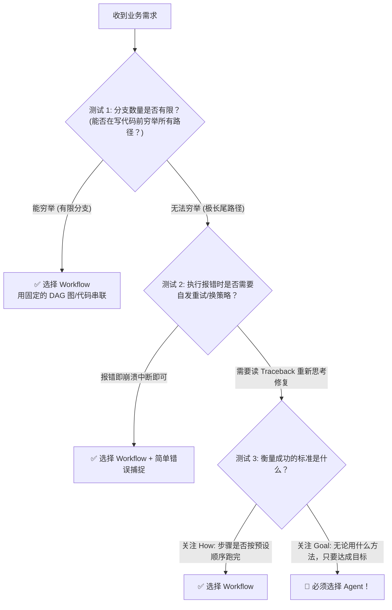

# 07-短笔记：我的场景为什么需要 Agent，而不是普通 Workflow？

> **一页纸决策卡片 (One-Page Executive Note)**  
> **适用对象**：架构师、产品经理、AI 开发工程师  
> **核心命题**：面对一个新的自动化需求，我凭什么决定使用 **Agent（自主智能体）**，而不是更便宜、更稳定的 **Workflow（确定性工作流）**？

---

## 🎯 一句话总结

> **Workflow 解决的是“人类已知固定路径”的效率自动化；**  
> **Agent 解决的是“人类只给终点目标，中间路径需要自适应探索与自我修正”的复杂自动化。**

---

## 🔍 三大分水岭测试 (The 3 Watershed Tests)

你可以通过以下 3 个关键测试，在 1 分钟内判断自己的业务场景是否必须引入 Agent：

---

### 🧪 测试 1：分支爆炸测试 (Branch Explosion Test)

* **选 Workflow 的情况**：
  - 业务逻辑为 `如果输入是 A，执行步骤 1；如果输入是 B，执行步骤 2`。
  - 分支条件有限，程序员可以在开发阶段用 `If-Else` 或节点编排完全穷举。
* **必须选 Agent 的情况**：
  - 路径存在**组合爆炸**或**极长尾不确定性**。
  - *例*：自动修复 GitHub 上的任意 Bug。你无法提前穷举“修这个 Bug 需要改哪几个文件、用什么顺序改”。这需要大模型根据项目现状**动态规划路径**。

---

### 🧪 测试 2：容错与自愈测试 (Self-Healing Test)

* **选 Workflow 的情况**：
  - 中间某个步骤（如调 API 报 500，或提取字段为空）失败后，系统直接抛出异常告警、通知人工介入即可。
* **必须选 Agent 的情况**：
  - 系统必须具备**自适应自愈能力**。
  - *例*：Agent 编写并运行了一段 Python 代码提取数据，系统报错 `SyntaxError: unexpected indent`。
  - Workflow 会直接挂掉；而 Agent 能够把这个报错信息包装成 **Observation** 喂回给大脑，在下一个 **Think** 阶段分析报错原因，自动改对代码并重新运行，直到成功！

---

### 🧪 测试 3：目标导向 vs. 步骤导向测试 (Goal-Oriented Test)

* **选 Workflow 的情况**：
  - 系统的核心要求是**过程可控**。必须严格按照：步骤 1 → 步骤 2 → 步骤 3 顺序执行。
* **必须选 Agent 的情况**：
  - 系统的核心要求是**结果交付 (Goal-Oriented)**。
  - 用户只给高层目标（如：“帮我把今天竞争对手的所有促销策略调研清楚写成报告”）。至于 Agent 是通过搜索网络、翻阅历史数据库，还是调 API，只要最终拿到了合格的报告即可。

---

## ⚖️ 终极对比决策卡片

| 维度 | 普通 Workflow (工作流) | AI Agent (自主智能体) |
| :--- | :--- | :--- |
| **人类输入** | **How-to (详细步骤)** | **Goal (终点目标)** |
| **控制权** | **人类硬编码代码** (固定 DAG 图) | **LLM 大脑** (自适应闭环) |
| **应对报错** | 中断抛错，需人工修复 | **自发读取 Traceback，自我修正重试** |
| **路径形态** | 静态树状图 (固定 If-Else) | 动态图 (根据环境反馈实时生长) |
| **成本与时延** | 低成本、毫秒级响应、100% 确定 | 消耗 Token、秒级延迟、应对复杂性 |

---

## 💡 落地建议

在实际工程落地时，遵循**“能用 Workflow 绝不用 Agent，只有在需要自适应探索和错误修复的节点，才嵌入 Agent”**的混合原则。

* **典型混合架构**：
  `确定性工作流 (准备数据)` → `确定性工作流 (预校验)` → `🤖 Agent (自主探索与解决疑难)` → `确定性工作流 (格式化输出)`

---

*文件归档：[c:\Haven-AI\02-Agent-Architecture\07-Short-Note-Why-Agent-Over-Workflow.md](file:///c:/Haven-AI/02-Agent-Architecture/07-Short-Note-Why-Agent-Over-Workflow.md)*
