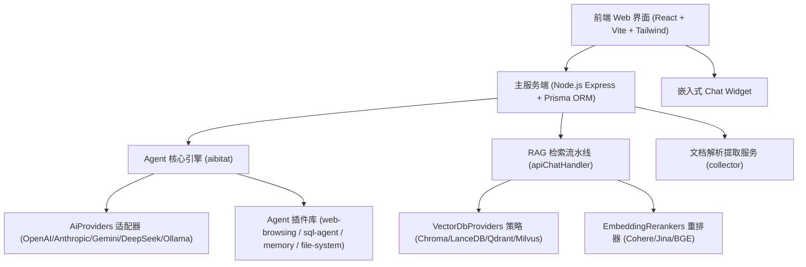

# 08-开源企业级 RAG 与 Agent 系统架构深度拆解：AnythingLLM

> **源码仓库**：[Mintplex-Labs/anything-llm](https://github.com/Mintplex-Labs/anything-llm)  
> **核心定位**：全球最流行的开源企业级自托管 AI 知识库与 Agent 工作台。  
> **学习价值**：全景展示了单体/微服务解耦、多模型适配器模式、多向量数据库策略模式、RAG 检索流水线以及 Agent 插件化引擎的真实工业级代码落地。

---

## 🏗️ 一、 AnythingLLM 整体系统架构全景

---

## 🧱 二、 六大核心工程设计模式 (Architecture Patterns)

### 1. 多 AI 模型适配器模式 (AiProviders Adapter)
* **源码目录**：`server/utils/AiProviders/`
* **设计原理**：定义统一的接口方法 (`sendChat`, `streamChat`, `embedTextInput`, `compressText`)，派生出 20+ 种主流大模型适配器（`OpenAi.js`, `Anthropic.js`, `Gemini.js`, `DeepSeek.js`, `Ollama.js`, `AzureOpenAi.js` 等）。
* **工程价值**：上层 RAG 与 Agent 引擎完全与具体模型解耦，切换模型只需更改环境变量或配置项。

---

### 2. 多向量数据库策略模式 (VectorDbProviders Strategy)
* **源码目录**：`server/utils/vectorDbProviders/`
* **设计原理**：定义统一的向量数据库抽象策略类（包含 `connect()`, `similarityResponse()`, `addDocument()`, `deleteDocument()`）。
* **支持数据库**：`Chroma.js`, `LanceDb.js` (本地嵌入式), `Qdrant.js`, `Pinecone.js`, `Weaviate.js`, `Milvus.js`, `PgVector.js`。
* **工程价值**：企业可根据数据量级自由选择本地轻量存储 (LanceDB/Chroma) 或分布式向量集群 (Milvus/Qdrant)。

---

### 3. RAG 检索流水线 (Pipeline Pattern)
* **源码目录**：`server/utils/chats/apiChatHandler.js`
* **标准 RAG 流转步骤**：
  1. **查询输入**：接收用户 Prompt。
  2. **向量初筛 (Vector Search)**：调用选择的向量数据库，根据 Embedding 计算向量余弦相似度，拉取 Top-20 文本切片 (Chunks)。
  3. **Cross-Encoder 重排精筛 (Rerank)**：调用 `EmbeddingRerankers` (如 BGE-Reranker)，对 20 条切片进行二次交叉打分，丢弃低相关噪音，精准截取 Top-3~Top-5。
  4. **上下文注入与溯源**：将切片文本与元数据（文件名、页码、图表链接）拼接进 System Prompt。
  5. **流式输出**：调用 LLM 进行流式回答，并实时反哺 `citations` 引用列表。

---

### 4. Agent 插件化与工具注册表 (Plugin & Tool Registry)
* **源码目录**：`server/utils/agents/aibitat/plugins/`
* **核心插件库**：
  - `web-browsing.js`：网页抓取与动态浏览器渲染。
  - `sql-agent/`：数据库 Schema 提取与动态 SQL 自动化查询。
  - `memory.js`：会话短期与中长期记忆读写。
  - `rechart.js`：数据图表动态渲染。
  - `request-user-input.js`：Human-in-the-loop 人工干预确认。
* **设计机制**：每个工具都是一个符合 `aibitat` 规范的自包含插件，暴露 JSON Schema 参数描述与异步 `handler` 处理代码。

---

### 5. 多租户工作区隔离 (Workspace Isolation)
* **源码目录**：`server/models/workspace.js`
* **设计机制**：AnythingLLM 提出了 **Workspace（工作区）** 的隔离概念。每个 Workspace 拥有独立的不同 Document 索引、独立的 System Prompt、不同的 Vector DB Collection 以及独立配置的 Agent 工具集，完美实现了企业多部门的数据隔离。

---

### 6. 文档提取采集服务 (Collector Architecture)
* **源码目录**：`collector/`
* **设计原理**：将耗费 CPU/内存的文件解析与 OCR 处理从主 API 服务器剥离，形成独立的 Collector 服务。
* **支持格式**：PDF, DOCX, XLSX, CSV, HTML, Markdown, EPUB, MP3/MP4 (Whisper 语音转文字)。

---

## 💡 三、 AnythingLLM 给我们 Stage 2 开发的黄金启示

1. **RAG 必须做重排 (Reranking)**：单纯靠向量相似度拉出来的切片往往包含很多表面相关但实质无关的噪音。引入 Reranker 二次打分是提升回答质量的关键。
2. **工具必须插件化 (Plugin System)**：将网页搜索、代码执行、数据库查询解耦为独立的插件，主控制循环只负责调度。
3. **隔离解耦设计**：向量数据库、LLM 提供商、文档提取器都必须做抽象隔离，保证代码高度可扩展。

---

*文件归档：[c:\Haven-AI\02-Agent-Architecture\08-AnythingLLM-Architecture-Study.md](file:///c:/Haven-AI/02-Agent-Architecture/08-AnythingLLM-Architecture-Study.md)*
