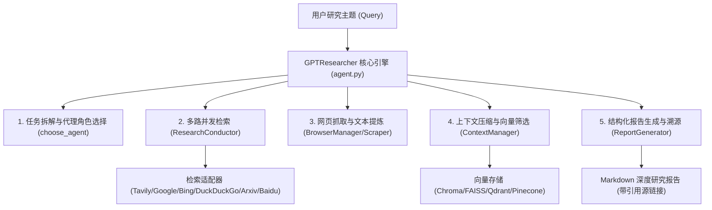

# 08-开源纯 Python 深度研究 Agent 架构拆解：GPT Researcher

> **源码仓库**：[assafelovic/gpt-researcher](https://github.com/assafelovic/gpt-researcher)  
> **语言类型**：**100% 纯正 Python**  
> **核心定位**：全球最主流的开源深度资料研究 Agent (Deep Research Agent) 框架。  
> **学习价值**：全景展示了如何用纯 Python 构建包含**任务子目标拆解、网页抓取与解析 (Scraper)、向量上下文管理 (Context Manager)、多源检索 (Retrievers) 与带引用报告生成 (Writer)** 的完整工业级 Agent。

---

## 🏗️ 一、 GPT Researcher 整体架构全景

---

## 🧱 二、 核心 Python 模块与设计模式拆解

### 1. 核心指挥器类 (`GPTResearcher` 在 `agent.py`)
* **源码位置**：`gpt_researcher/agent.py`
* **设计职责**：单例/对象化代理入口。负责接收 `query`、管理研究状态上下文、计算 Token/API 成本，并依次驱动 `Plan → Search → Scrape → Context → Write` 闭环。

---

### 2. 多源检索适配器模式 (`retrievers/`)
* **源码位置**：`gpt_researcher/retrievers/`
* **设计原理**：定义统一的检索器抽象，派生各种具体检索实现：
  - `tavily/`：Tavily Search API (专为 Agent 设计的高精准检索)。
  - `google/` / `bing/` / `duckduckgo/` / `baidu/`：通用搜索引擎。
  - `arxiv/`：学术论文检索。
* **架构优势**：支持在 `config` 中一键切换检索源，或混合多路并发检索。

---

### 3. 网页抓取与清洗引擎 (`scraper/`)
* **源码位置**：`gpt_researcher/scraper/`
* **处理组件**：
  - `bs4` (BeautifulSoup) / `newspaper`：快照纯文本抽取。
  - `playwright` / `selenium`：动态 JavaScript 渲染网页抓取。
  - `firecrawl`：智能网页转 Markdown 提取。

---

### 4. 向量上下文压缩与去噪 (`context/` & `skills/context_manager.py`)
* **源码位置**：`gpt_researcher/context/` 与 `gpt_researcher/skills/context_manager.py`
* **核心动作**：
  1. **切片 Chunking**：将抓取的大段网页切成固定长度片段。
  2. **向量相似度匹配 (Vector Match)**：通过 `vector_store` 对比切片与查询意图的欧氏/余弦距离。
  3. **去重与去噪**：过滤无关广告、页脚等无用信息，保留最核心的 Context 证据。

---

### 5. 带有出处引用的报告生成器 (`skills/writer.py`)
* **源码位置**：`gpt_researcher/skills/writer.py` 与 `prompts.py`
* **设计技巧**：在 Prompt 中将筛选后的上下文标号 `[Source 1: URL]`, `[Source 2: URL]`，要求 LLM 生成报告时在结论处附带精准的引用标记，实现 100% 可追溯。

---

## 💡 三、 GPT Researcher 给我们 Stage 2 Lab 02 的黄金启示

1. **结构极度清晰**：每一个功能（搜索、抓取、上下文压缩、写作）都是独立的 Python 模块，代码可读性极高。
2. **完全符合 Stage 2 终极产出**：Lab 02 的资料研究助手 (Deep Research Agent) 核心逻辑与 `gpt-researcher` 完全对齐！
3. **异步并发性能**：全流程使用 Python `asyncio`（如 `asyncio.gather`），支持并发抓取多个网页，大幅降低等待延时。

---

*文件归档：[c:\Haven-AI\02-Agent-Architecture\08-GPT-Researcher-Architecture-Study.md](file:///c:/Haven-AI/02-Agent-Architecture/08-GPT-Researcher-Architecture-Study.md)*
