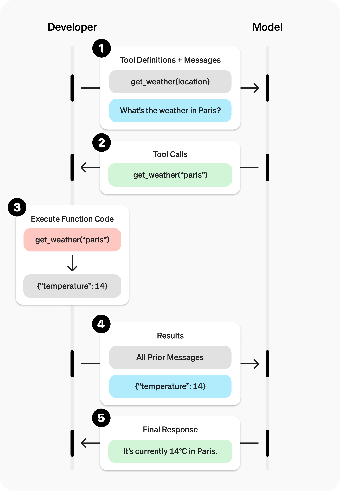

# 01-OpenAI 官方最新指南：Function Calling 与 Custom Tools 深度解析

> **出处**：OpenAI 官方开发者指南 (*Function Calling Guide*, 包含 GPT-5 / Responses API 最新规范)  
> **核心意义**：展示了 OpenAI 从传统 JSON Function Calling 演进到 **Responses API、Tool Search 动态检索、Namespaces 命名空间、Custom Tools 自定义工具以及 CFG (上下文无关文法强约束)** 的最新架构全貌。

---

## ☕ Java 后端工程师视角：核心技术演进映射

对于 Java 后端工程师，OpenAI 最新的 Function Calling 规范完全对应了后端微服务与接口设计的最新演进：

| OpenAI 最新 API 特性 | Java 后端对应概念 | 说明 |
| :--- | :--- | :--- |
| **Function Tools** | **RESTful API / Swagger DTO 接口** | 传统 JSON Schema 驱动的结构化参数接口。 |
| **Namespaces (命名空间)** | **微服务包名划分 (`com.crm`, `com.billing`)** | 按业务领域（CRM、计费、物流）对工具分组，避免接口混淆。 |
| **Tool Search (`tool_search`)** | **Spring Cloud API 网关动态服务发现 (Nacos / Consul)** | 工具库庞大时（成百上千），延迟加载（Defer Loading），按需动态搜索路由。 |
| **Custom Tools (自定义工具)** | **自定义 DSL / 脚本执行器 (Groovy / Shell)** | 允许模型直接吐出纯文本字符串（如 Python 代码），无需 JSON 包装。 |
| **CFG 文法约束 (Lark / Regex)** | **ANTLR 4 语法解析器 / 强正则校验器** | 强行约束 Custom Tools 的输出字符串 100% 匹配特定的文法规则。 |
| **`allowed_tools`** | **接口权限过滤 / API 限流子集** | 保持全量 Tools 定义（享受 Prompt Caching 缓存）的同时，动态限制本次调用的子集。 |

---

## 🔄 一、 最新 Responses API 的 5 步交互闭环

OpenAI 新一代 API 采用了 **`responses.create`** 替代传统的 Chat Completions，交互流如下：

.jpg)

---

## 🧱 二、 工具定义的四大高级模式

### 1. 标准 Function Tools (带 Strict 严格模式)
通过 JSON Schema 定义函数入参，开启 `strict: true` 保证零参数幻觉：

```json
{
  "type": "function",
  "name": "get_weather",
  "description": "获取指定城市的当前天气情况",
  "strict": true,
  "parameters": {
    "type": "object",
    "properties": {
      "location": { "type": "string", "description": "城市与国家，如：Bogotá, Colombia" },
      "units": { "type": "string", "enum": ["celsius", "fahrenheit"], "description": "温度单位" }
    },
    "required": ["location", "units"],
    "additionalProperties": false
  }
}
```

---

### 2. Namespaces（命名空间分组）
当应用包含多个系统的工具时，用 Namespace 按领域隔离：

```json
{
  "type": "namespace",
  "name": "crm",
  "description": "客户关系管理 (CRM) 与订单查询工具集",
  "tools": [
    {
      "type": "function",
      "name": "get_customer_profile",
      "description": "根据客户 ID 获取客户档案",
      "parameters": { "type": "object", "properties": { "customer_id": { "type": "string" } }, "required": ["customer_id"], "additionalProperties": false }
    },
    {
      "type": "function",
      "name": "list_open_orders",
      "description": "查询未结清订单",
      "defer_loading": true,  // 延迟加载标志
      "parameters": { "type": "object", "properties": { "customer_id": { "type": "string" } }, "required": ["customer_id"], "additionalProperties": false }
    }
  ]
}
```

---

### 3. Tool Search (按需动态工具搜索)
* **解决痛点**：工具数量成百上千时，一次性把全部 Schema 塞入上下文会耗费大量 Token 成本，且容易干扰模型注意力。
* **工作机制**：将不常用的工具标记 `"defer_loading": true`。模型需要时先触发 `tool_search` 搜索并加载工具，再发起具体调用。

---

### 4. Custom Tools 与 CFG 文法约束 (Lark & Regex)
* **Custom Tools**：允许模型直接输出**纯文本**（例如：直接输出多行 Python 代码 `print("hello world")`），无需 JSON 包装。
* **Context-Free Grammars (CFG 上下文无关文法)**：
  通过 `format` 参数配置 **Lark** 或 **Regex** 语法规则，让模型吐出的文本必须 100% 遵守文法规范（例如写数学公式只能输出 `4 + 4`，无法输出违法词汇）。

```python
# 使用 Regex 强约束 Custom Tool 的输出格式
grammar = r"^(?P<month>January|February|March|April|May|June|July|August|September|October|November|December)\s+(?P<day>\d{1,2})(?:st|nd|rd|th)?\s+(?P<year>\d{4})\s+at\s+(?P<hour>0?[1-9]|1[0-2])(?P<ampm>AM|PM)$"

tools = [
    {
        "type": "custom",
        "name": "timestamp",
        "description": "保存日期与时间的打卡记录",
        "format": {
            "type": "grammar",
            "syntax": "regex",
            "definition": grammar
        }
    }
]
```

---

## ⚡ 三、 官方落地最佳实践 (Engineering Best Practices)

1. **实习生测试法 (The Intern Test)**：
   - 如果不看代码只看 Tool Description，给团队里的实习生看，他能用对这个工具吗？如果实习生会问你问题，就把答案补充到 Tool Description 里！
2. **卸载模型负担 (Offload Burden)**：
   - 不要让模型填写程序已经知道的参数（例如上一步菜单里已经选好的 `order_id`），直接用代码带入，工具参数设为空即可。
3. **控制初始暴露工具数量**：
   - 一轮对话中初始露脸的工具数量建议**小于 20 个**，其余工具使用 `tool_search` 延迟加载。
4. **利用 `allowed_tools` 优化 Prompt Caching**：
   - 不要在不同请求中频繁修改 `tools` 数组结构（会导致 Prompt Cache 缓存失效）；使用 `tool_choice: {"type": "allowed_tools", "tools": [...]}` 来动态限制本次可选工具！

---

*文件归档：[c:\Haven-AI\03-Frameworks-and-Tools\01-OpenAI-Function-Calling-Guide.md](file:///c:/Haven-AI/03-Frameworks-and-Tools/01-OpenAI-Function-Calling-Guide.md)*
