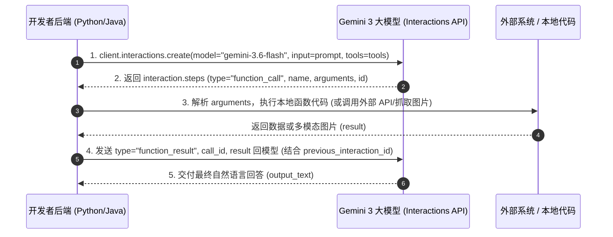

# 02-Google Gemini 官方指南：Function Calling 与多模态函数响应 深度解析

> **出处**：Google Gemini API 官方文档 (*Function Calling Guide*, 包含 Gemini 3 系列 / Interactions API 规范)  
> **核心意义**：展示了谷歌 Gemini 在 **多模态工具响应 (Multimodal Tool Response)、远程 MCP 服务器集成、内置工具 (Google Search) 混用** 以及独创的 **“专用 Update 工具替代前置文本”防错解法** 上的最新架构设计。

---

## ☕ Java 后端工程师视角：核心技术演进映射

对于 Java 后端工程师，Gemini API 的最新特性与后端高阶架构模式高度契合：

| Gemini 最新 API 特性 | Java 后端对应概念 | 说明 |
| :--- | :--- | :--- |
| **Interactions API** | **分布式微服务 Session 容器** | 传入 `previous_interaction_id` 自动恢复会话，支持服务端有状态与客户端无状态模式 (`store=False`)。 |
| **Multimodal Function Result** | **二进制多媒体 DTO 返回** | 工具不仅能返 JSON/文字，还能返图片 Base64，类似 Spring MVC 返回 `byte[]` / `Resource`。 |
| **Remote MCP Server** | **RPC 远程服务调用 (Dubbo / Spring Cloud)** | 直接配置 `mcp_server` URL，远程调用标准化的 MCP 协议微服务工具。 |
| **Update Function Workaround** | **审计日志切面 (Audit AOP Aspect)** | 把思考/计划日志变成专门的 `update()` 拦截器工具，解决前置文本导致的协议报错。 |

---

## 🔄 一、 Gemini 核心交互闭环 (The 4-Step Lifecycle)

Gemini Interactions API 采用了 **`client.interactions.create`** 规范：



---

## 🌟 二、 谷歌 Gemini 独有的四大黑科技特性

### 1. 多模态函数响应 (Multimodal Function Response)
* **核心突破**：传统大模型调工具只能返回字符串/JSON。Gemini 3 支持在 `function_result` 中直接返回**图片等多模态数据**！
* **代码规范**：
  ```python
  # 工具执行完后，不仅返回文件名，还直接附带图片 Base64 字节流
  input_data = [
      {
          "type": "function_result",
          "name": fc_step.name,
          "call_id": fc_step.id,
          "result": [
              {"type": "text", "text": "instrument.jpg"},
              {
                  "type": "image",
                  "mime_type": "image/jpeg",
                  "data": base64_image_data,  # 图片 Base64
              },
          ],
      }
  ]
  ```
* **效果**：模型在下一轮回答中可以直接“看懂”工具抓取回来的图片并做分析。

---

### 2. 内置工具与自定义函数混用 (Google Search + Custom Functions)
Gemini 3 原生支持在同一个 API 请求中，将** Google 实时搜索 (`{"type": "google_search"}`)** 与你的**自定义业务函数 (`get_weather`)** 混合挂载：
```python
tools = [
    {"type": "google_search"},  # 谷歌官方内置搜索
    get_weather_function        # 自定义业务函数
]
```
模型会自发判断先用 Google Search 找到最北边的城市，再调用你的 `get_weather` 函数查天气！

---

### 3. 远程 MCP 服务器直连 (Remote MCP Server)
你可以无需手写工具包装代码，直接在 `tools` 中配置远程 **MCP Server** 的 URL，Gemini 会自动进行服务发现与工具调用：

```python
tools = [
    {
        "type": "mcp_server",
        "name": "weather_mcp",
        "url": "https://gemini-api-demos.uc.r.appspot.com/mcp",
        "headers": {"Authorization": "Bearer token"}
    }
]
```

---

### 4. 工具前文本报错的官方首选解法 (Preferred Workaround) ★硬核工程坑点

* **工程痛点与报错根源**：
  在写复杂 Agent 时，开发者往往希望模型在调业务工具（如 `set_thermostat`）前，先写一段 XML/纯文本思考日志（如 `<UPDATE>计划分析...</UPDATE>`）。
  在 Function Calling 模式下，API 协议要求响应必须是纯干净的 JSON 对象。如果模型**“前半句吐 XML 自由文本，后半句切 API 函数 JSON”**，API 服务端在解析协议时会被前置文本卡住，直接引发 **`Malformed_Function_Call`（畸形函数调用报错）**。
  
  > **☕ Java 后端类比**：这就好比 Spring Boot 的 `@PostMapping` 接口规定前端必须发送 `application/json` Body。结果前端在 JSON 串最前面插了一段 XML 文本 `<UPDATE>...</UPDATE>`，导致 Spring 框架的 `Jackson` 解析器抛出 `JsonParseException` 导致 500 崩溃！

* **谷歌官方优雅解法（变装为 `update` 工具）**：
  **不要让模型吐前置文本，而是把“写思考笔记”这个动作本身，也注册为一个标准的 `update` 工具函数！**

* **Schema 与调用范例**：
  开发者声明 2 个工具：
  1. 日志工具：`update(previous_step, plan, next_step, external)`
  2. 业务工具：`set_thermostat(temperature)`

  模型在同一轮次中发起**并行函数调用 (Parallel Tool Calling)**：
  ```json
  [
    {
      "type": "function_call",
      "name": "update",
      "arguments": {
        "previous_step": "上一步查到了伦敦温度是 22 度",
        "plan": "目标是保持室内舒适",
        "next_step": "准备把空调调到 20 度",
        "external": "正在为您调节空调温度..."
      }
    },
    {
      "type": "function_call",
      "name": "set_thermostat",
      "arguments": { "temperature": 20 }
    }
  ]
  ```

* **三大架构优势**：
  1. **协议 100% 干净**：输出均为合法 JSON，彻底解决 `Malformed_Function_Call` 解析崩溃。
  2. **后端日志切面 (AOP Aspect)**：Java 后端可直接提取 `update` 参数写入 MySQL/ES 日志流水表做业务审计。
  3. **强类型约束**：用 JSON Schema 强约束思考的 4 个字段，避免模型瞎写自由文本。

---

## ⚙️ 三、 Tool Choice 工具调控模式

在 `generation_config` 中配置 `tool_choice` 来调控模型行为：

* `auto`（默认）：模型自主决定是调用函数还是直接回答。
* `any`：强制模型**必须**发起函数调用（对应 OpenAI 的 `required`）。
* `none`：禁止函数调用。
* `validated`：强约束 Schema 合规校验。

---

## 📊 终极对比：OpenAI vs. Google Gemini Function Calling

| 维度 | OpenAI Function Calling | Google Gemini Function Calling |
| :--- | :--- | :--- |
| **API 接口** | `client.responses.create(...)` | `client.interactions.create(...)` |
| **多模态返回值** | 仅支持字符串 / 文本 | **原生支持返回图片 (Image Base64) 等多模态数据** |
| **内置工具混用** | Code Interpreter / Web Search 需专门定义 | **原生支持 `google_search` 与自定义 Tool 混合派发** |
| **MCP 远程协议** | 需客户端手动挂载 MCP Client | **原生支持直接配置远程 `mcp_server` URL** |
| **前置思考日志** | 支持格式化输出 | **推荐使用 `update()` 专用工具规避文本报错** |

---

*文件归档：[c:\Haven-AI\03-Frameworks-and-Tools\02-Google-Gemini-Function-Calling-Guide.md](file:///c:/Haven-AI/03-Frameworks-and-Tools/02-Google-Gemini-Function-Calling-Guide.md)*
