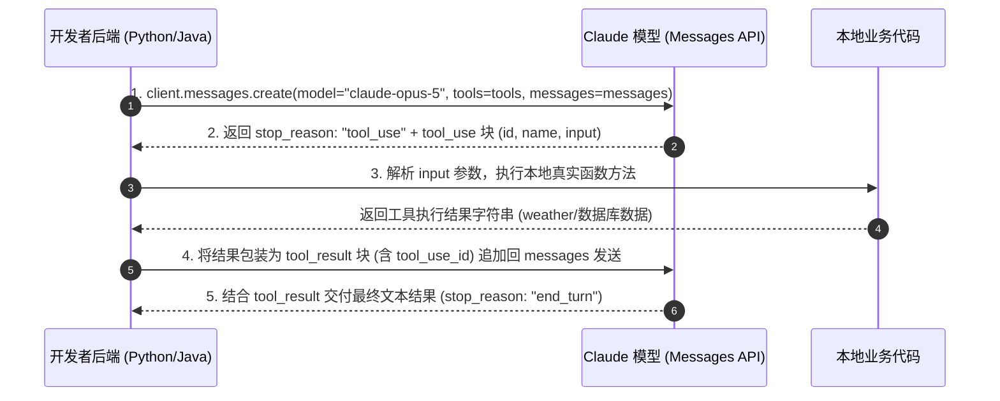
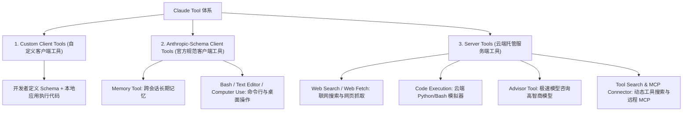

# 03-Anthropic Claude 官方指南：Tool Use (工具使用 API) 权威指南与架构拆解

> **出处**：Anthropic 官方开发者指南 (*Tool Use with Claude*, Claude Platform Docs 2026 最新规范)  
> **核心意义**：展示了 Anthropic Claude 独特的 **三维工具类型划分（Client / Schema-Client / Server Tools）**、云端托管工具体系、SDK Tool Runner 自动化轮询以及系统提示词 Token 消耗模型。

---

## ☕ Java 后端工程师视角：核心技术演进映射

对于 Java 后端工程师，Claude 的工具设计体现了极致的架构解耦思想：

| Claude Tool Use 特性 | Java 后端对应概念 | 说明 |
| :--- | :--- | :--- |
| **Client Tools (客户端工具)** | **本地 Service 方法回调 (Local Beans)** | 应用自己定义 Schema，并在本地服务器运行具体业务代码。 |
| **Anthropic-Schema Tools** | **标准 SPI / SDK 框架规范实现** | 官方统一定义 Schema（如 `bash`, `text_editor`），开发者负责本地容器实现。 |
| **Server Tools (服务端托管工具)** | **云端 SaaS API 微服务 (Cloud Managed API)** | 运行在 Anthropic 云端基础设施上（如 `web_search`, `code_execution`），开发者零代码直接收结果！ |
| **`stop_reason: "tool_use"`** | **状态机挂起 / 中断机制 (State Interruption)** | 类似工作流引擎挂起，等待外部系统返回执行结果。 |
| **`tool_result`** | **Async Callback DTO / Webhook 响应** | 携带 `tool_use_id` 将工具执行结果作为 `user` 角色消息返回。 |
| **Advisor Tool (导师工具)** | **分级智能体架构 (Fast Worker + Smart Consultant)** | 允许低成本极速模型 (Executor) 在生成中途动态咨询高智商导师模型 (Advisor)。 |

---

## 🔄 一、 客户端工具 5 步交互闭环 (Client Tool Round Trip)

对于开发者自定义的 Client Tools，Messages API 遵循标准的 5 步双向轮询：



---

## 🧱 二、 三维工具形态分类全景表

Anthropic 将所有工具划分为三大层次：



### 1. Custom Client Tools (自定义客户端工具)
* 开发者定义 `input_schema`（基于 JSON Schema 标准）。
* 本地应用捕获 `tool_use` 响应，执行代码后通过 `tool_result` 返回。

### 2. Anthropic-Schema Client Tools (官方规范客户端工具)
* 官方统一定义 Schema，并在模型层做针对性微调与训练（如 `bash`, `text_editor`, `memory`, `computer_use`）。
* **代码依然由开发者本地容器执行**。

### 3. Server Tools (云端托管服务端工具) ★极大简化开发
* 完全运行在 **Anthropic 云端基础设施** 上，**开发者无需编写任何本地执行代码**，调用响应中直接包含云端执行后的成果！
  - `web_search`：云端联网搜索并附带精准引用源。
  - `web_fetch`：云端抓取网页与 PDF 完整内容。
  - `code_execution`：云端沙盒运行 Python 和 Bash。
  - `advisor`：极速工作模型中途咨询高智商导师模型。
  - `tool_search`：成百上千工具时动态搜索装载。
  - `MCP connector`：直接连接远程 MCP 服务器。

---

## ⚙️ 三、 引导系统提示词与 Token 计费模型

Anthropic 揭秘了工具调用背后的 Token 消耗机制：

```text
请求总 Token 消耗 = 
  基础 Prompt Tokens 
+ tools 参数定义 Tokens (Schema 描述)
+ 自动注入的工具系统提示词 (Implicit System Prompt Tokens)
+ tool_use 输出 Token
+ tool_result 输入 Token
```

### 自动注入系统提示词 (Tool-use System Prompt Token)

只要请求中传递了 `tools` 参数，API 会在后台**自动隐式注入一段引导模型进行工具调用的系统提示词**，具体 Token 如下表：

| 模型型号 | `auto` / `none` 模式隐式 Token | `any` / `tool` 强制模式隐式 Token |
| :--- | :--- | :--- |
| **Claude Opus 5** | 286 tokens | 406 tokens |
| **Claude Opus 4.8** | 290 tokens | 410 tokens |
| **Claude Sonnet 5** | 354 tokens | 474 tokens |
| **Claude Sonnet 4.6** | 497 tokens | 589 tokens |
| **Claude Haiku 4.5** | 496 tokens | 588 tokens |

* **优化提示**：当设置 `tool_choice: "none"` 或不传 `tools` 时，系统提示词消耗归零（0 Token）。

---

## 💡 四、 官方推荐落地最佳实践

1. **显式控制触发行为 (Prompt Steering)**：
   - 默认 `auto` 模式下，如果 Claude 调工具不积极，可以在 System Prompt 中增加轻量引导：“*Use the tools to investigate before responding.*”
   - 强力强制引导：“*Always call a tool first before responding.*”
   - 保守调控：“*Use your judgment about whether to call a tool or respond directly.*”
2. **使用 SDK Tool Runner**：
   - Anthropic 官方 SDK 内置了 `Tool Runner`，可以自动循环处理 `tool_use → tool_result` 的轮询，无需开发者自己写 `while` 循环。
3. **禁用并发调用**：
   - 若要求每轮只能触发 1 个工具，可在 `tool_choice` 中设置 `"disable_parallel_tool_use": True`。

---

## 💡 五、 核心概念深度剖析与 Java 后端类比 

为了方便复习回顾，将 Claude Tool Use 官方文档中最晦涩的 4 个概念拆解如下：

### 1. Client Tools vs Server Tools（代码到底在谁家服务器上跑？）
* **Client Tools (客户端工具)**：
  - **谁跑代码**：你的本地 Java/Python 后端。
  - **场景**：你写的数据库查询 `OrderService.queryOrder()`，或者本地调第三方天气接口。
  - **机制**：LLM 只负责吐参数（出嘴），你的服务器负责运行业务逻辑（出腿）。
* **Server Tools (服务端托管工具)**：
  - **谁跑代码**：Anthropic 的云端基础设施。
  - **场景**：联网搜索 `web_search`、沙盒运行代码 `code_execution`。
  - **机制**：开发者**零代码执行**！把请求发过去，Anthropic 云端帮你搜好/跑好，直接在 API 响应里拿到答案。

### 2. `stop_reason: "tool_use"`（工作流挂起机制）
* **Java 后端类比**：类似于 **Activiti / Camunda 工作流引擎** 在遇到 User Task 或外部 Service Task 时发生的**中断/挂起 (Suspend State)**。
* **机制**：LLM 意识到自己无法直接回答（比如不知道实时天气），于是暂停文本生成，输出标志位 `stop_reason: "tool_use"`，意思就是：“*我停下了！该你本地代码干活了，把接口调完结果发回给我！*”

### 3. SDK `Tool Runner` 自动化
* **解决痛点**：如果不使用 Tool Runner，开发者需要手写 `while` 循环去捕获 `tool_use`、调用本地函数、拼接 `tool_result` 再发起第二轮 HTTP 请求。
* **优雅解法**：Anthropic 官方 SDK 内置了 `Tool Runner`，自动在后台帮开发者跑完这两轮轮询，开发者只需挂载本地函数，即可一步到位拿到最终响应。

### 4. `Advisor Tool` (导师模型分层架构)
* **设计精髓**：**极速低成本模型 (Executor) + 高智商导师模型 (Advisor)** 的黄金组合。
* **机制**：让响应极快、价格便宜的低阶模型（如 Claude Haiku 4.5）在前线干活。当它在中途遇到极其复杂的推理难题时，触发 `Advisor Tool` 动态向云端高智商导师模型（如 Claude Opus 5）现场请教。导师给出解答后，低阶模型再继续极速输出！

---

## 📊 终极对比：OpenAI vs. Google Gemini vs. Anthropic Claude

| 维度 | OpenAI Function Calling | Google Gemini Function Calling | Anthropic Claude Tool Use |
| :--- | :--- | :--- | :--- |
| **工具架构** | 自定义工具 + Code Interpreter | 自定义函数 + Google Search | **三维划分 (Client / Schema / Server Tools)** |
| **云端托管工具** | 代码解释器 (Code Interpreter) | 谷歌搜索 (`google_search`) | **全套 Server Tools (搜索/抓取/代码执行/Advisor)** |
| **SDK 自动化** | 需手写 / Assistants API | 需手写循环 / Interactions | **内置 Tool Runner 自动轮询** |
| **导师模型机制** | 无 | 无 | **原生支持 Advisor Tool 模式** |
| **底层系统提示词** | 隐式消耗 Token | 隐式处理 | **公开透明列出各型号 System Prompt Token 占用** |

---

*文件归档：[c:\Haven-AI\03-Frameworks-and-Tools\03-Anthropic-Claude-Tool-Use-Guide.md](file:///c:/Haven-AI/03-Frameworks-and-Tools/03-Anthropic-Claude-Tool-Use-Guide.md)*
