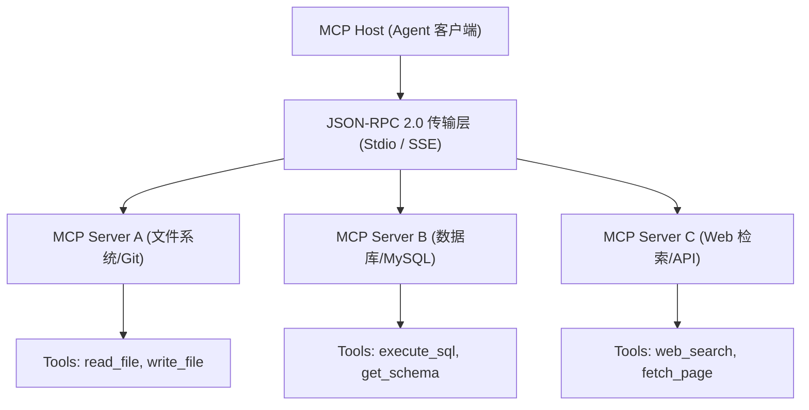

# 04-Model Context Protocol (MCP) 开放协议权威指南

> **出处**：Anthropic 官方开放标准 (*Model Context Protocol 2026 规范*)  
> **核心意义**：MCP 是 AI 时代的 USB 标准接口与微服务协议，旨在统一大模型与外部数据源、工具及上下文的交互方式。

---

## ☕ Java 后端工程师视角：架构映射

| MCP 协议概念 | Java 后端对应概念 | 详细说明 |
| :--- | :--- | :--- |
| **MCP Host / Client** | **API Gateway (网关) / Spring RestTemplate** | 负责发起连接、发送 JSON-RPC 2.0 请求的宿主应用（如 Antigravity, Claude）。 |
| **MCP Server** | **Spring Boot Microservice (微服务节点)** | 暴露 Tools、Resources 与 Prompts 的独立微服务节点。 |
| **Tools (工具)** | **RESTful API / `@PostMapping`** | 可被大模型调用的可执行方法（含 JSON Schema）。 |
| **Resources (资源)** | **静态文件服务 / SQL View 视图** | 被动的只读上下文数据（如文件内容、数据库表结构）。 |
| **Prompts (提示词模板)** | **Velocity / Thymeleaf 模板引擎** | 预定义的标准提示词模板与参数填空。 |
| **JSON-RPC 2.0** | **gRPC / Dubbo 传输协议** | 基于 Stdio (标准输入输出) 或 HTTP/SSE 的底座通信协议。 |

---

## 🔄 一、 MCP 协议三层架构与通信闭环

---

## 💡 二、 为什么 Stage 2 必须掌握 MCP？

1. **避免重复造轮子**：不需要为 PostgreSQL、Git、Jira、Slack 各写一遍原生态工具接入代码；只要部署对应的 MCP Server，即可一键挂载全套工具！
2. **极佳的解耦性**：工具运行在独立的 MCP Server 进程中，崩溃不影响 Agent 主进程。
3. **生态兼容**：全网主流工具（Chrome DevTools, SQLite, GitHub）均已支持 MCP 协议。

---

*文件归档：[c:\Haven-AI\03-Frameworks-and-Tools\04-MCP-Model-Context-Protocol-Guide.md](file:///c:/Haven-AI/03-Frameworks-and-Tools/04-MCP-Model-Context-Protocol-Guide.md)*
