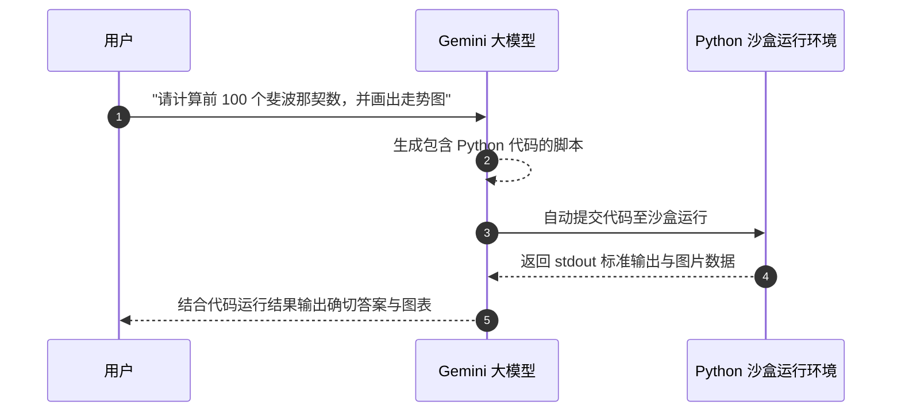

# 05-Google Gemini 代码执行 (Code Execution) 架构指南

> **出处**：Google Gemini API 官方文档 (*Code Execution Guide*)  
> **核心意义**：将大模型的概率性 Token 猜测，转变为精准、确定性的 Python 代码动态编译与沙盒执行。

---

## ☕ Java 后端工程师视角：架构映射

| Code Execution 概念 | Java 后端对应概念 | 详细说明 |
| :--- | :--- | :--- |
| **Code Execution Tool** | **Spring 动态脚本执行器 (Groovy / GraalVM)** | 允许应用在受控沙盒中动态编译并执行脚本。 |
| **Probabilistic vs Deterministic** | **模糊模糊算法 vs 确切数学/逻辑运算** | 解决 LLM 擅长自然语言但不擅长精确大数乘除与复杂统计的短板。 |
| **Sandbox Runtime** | **Docker 隔离容器 / JVM SecurityManager** | 安全隔离的代码运行沙盒，防止危险 Shell 命令注入。 |

---

## 🔄 一、 Code Execution 的工作流程

---

## 💡 二、 在 Stage 2 中的应用场景

1. **复杂数据分析**：处理大文本 CSV 或 JSON 格式时，直接让 Agent 写 Python Pandas 代码处理，效率提升 100 倍。
2. **零幻觉数学计算**：把数学推导交给 Python `eval()` 执行，杜绝大模型算错数字。

---

*文件归档：[c:\Haven-AI\03-Frameworks-and-Tools\05-Gemini-Code-Execution-Guide.md](file:///c:/Haven-AI/03-Frameworks-and-Tools/05-Gemini-Code-Execution-Guide.md)*
