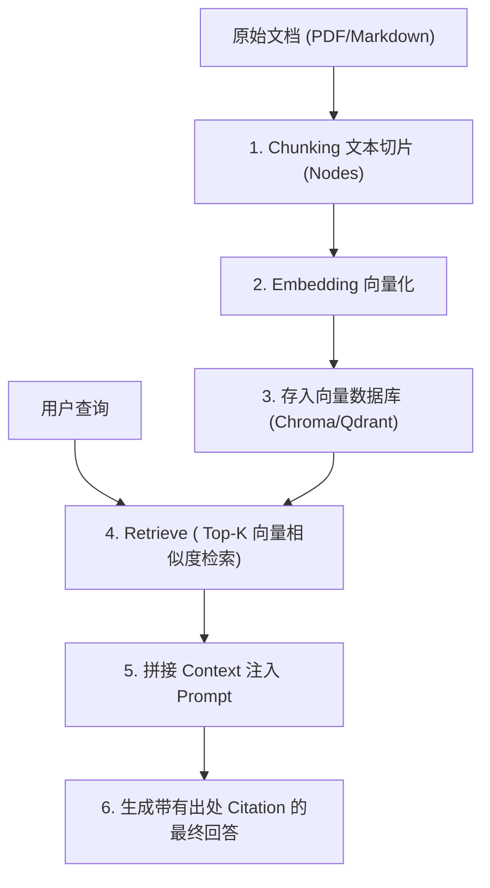

# 06-LlamaIndex 数据 RAG 与 Agent 工具化指南

> **出处**：LlamaIndex 官方文档 (*Agents and Use Cases Guide*)  
> **核心意义**：展示如何把数据加载器 (Data Loaders)、文本切片 (Chunking)、向量索引 (Vector Index) 封装为 Agent 的 `QueryEngineTool` 数据工具。

---

## ☕ Java 后端工程师视角：架构映射

| LlamaIndex 概念 | Java 后端对应概念 | 详细说明 |
| :--- | :--- | :--- |
| **SimpleDirectoryReader** | **Apache Tika / File Upload DAO** | 解析 PDF、Word、Markdown 文件的提取层。 |
| **Node / Chunking** | **数据库物理分页 (Pagination) / 分片** | 将大文档切割成适合 Embedding 的固定 Token 块。 |
| **VectorStoreIndex** | **Elasticsearch / Milvus 向量索引** | 存储向量嵌入并提供 k-NN (k-近邻) 相似度检索。 |
| **QueryEngineTool** | **DAO 查询服务暴露为 Agent Tool** | 将“数据库/文档查询服务”包装为带有 Schema 的 Tool 供 Agent 调用。 |

---

## 🔄 一、 RAG Agent 核心工作流 (Chunk → Embed → Retrieve → Answer)

---

## 💡 二、 解决幻觉引用的硬核方案

在 Stage 2 中，为了保证 Agent 不出现“伪造出处 (Hallucinated Citations)”：
* **数据透传**：检索到的每个 Node 必须包含唯一的 `file_name` 和 `page_number` 元数据 (Metadata)。
* **Prompt 校验**：要求模型严格按照 `[Document: file_name, Page: X]` 的格式在回答中附带角标。

---

*文件归档：[c:\Haven-AI\03-Frameworks-and-Tools\06-LlamaIndex-RAG-Agent-Guide.md](file:///c:/Haven-AI/03-Frameworks-and-Tools/06-LlamaIndex-RAG-Agent-Guide.md)*
