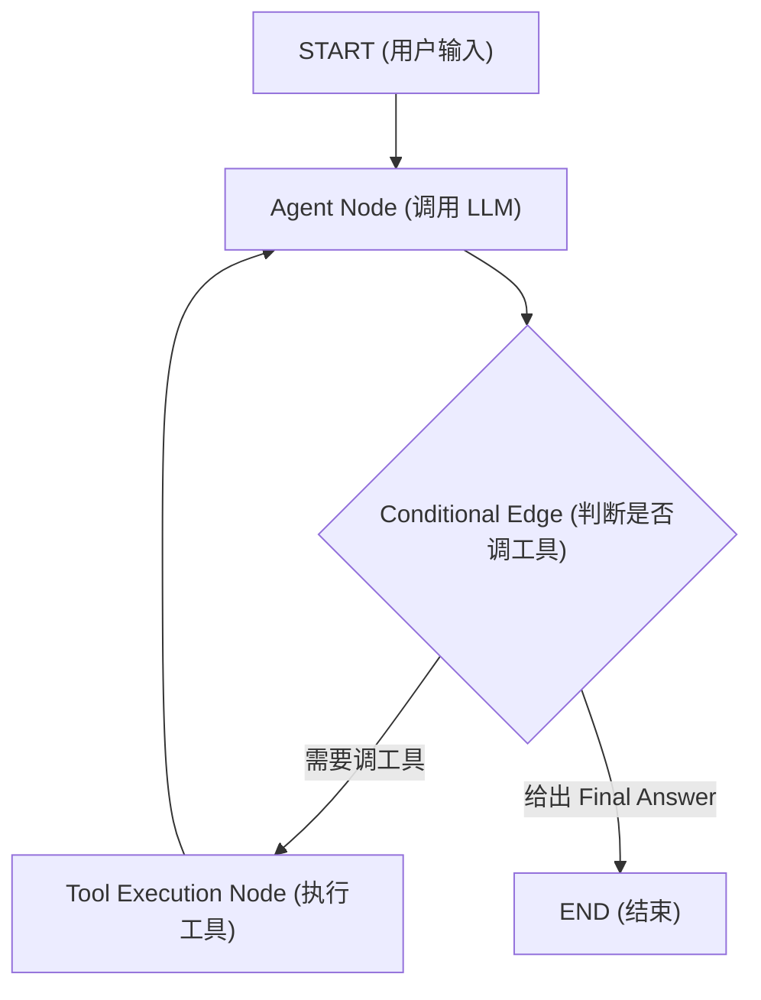

# 07-LangChain 与 LangGraph 基于图的状态机 Agent 指南

> **出处**：LangChain 官方文档 (*LangGraph Architecture Guide*)  
> **核心意义**：展示了如何使用基于**有向图 (Graph)** 的状态机模型，解决复杂 Agent 中的条件路由、循环重试与会话持久化问题。

---

## ☕ Java 后端工程师视角：架构映射

| LangGraph 概念 | Java 后端对应概念 | 详细说明 |
| :--- | :--- | :--- |
| **State (状态)** | **ThreadLocal Context / DTO Session 对象** | 贯穿整条链/图流转的共享状态字典（包含 `messages` 列表）。 |
| **Nodes (节点)** | **Spring Service 方法 / Handler** | 执行具体逻辑的单元（如 `agent_node`, `tool_node`）。 |
| **Edges (边) & Conditional Edges** | **工作流引擎分支路由 (If-Else / Switch)** | 根据 Node 输出决定走向下一个 Node 还是结束流程 (`END`)。 |
| **Checkpointer (持久化器)** | **Redis / Database Transaction Manager** | 将对话图的状态保存到 DB/Redis，实现会话断点续传。 |

---

## 🔄 一、 LangGraph 循环架构图

---

## 💡 二、 在 Stage 2 中的关键应用

1. **三级记忆切面 (Memory Checkpointing)**：使用 `MemorySaver` 将历史 Agent State 持久化，轻松区分**短期上下文 Window** 与 **长期数据库记忆**。
2. **容错重试路由**：当工具节点 `ToolNode` 报空结果或异常时，在 Conditional Edge 中路由到降级节点，而不是直接崩溃。

---

*文件归档：[c:\Haven-AI\03-Frameworks-and-Tools\07-LangChain-LangGraph-Guide.md](file:///c:/Haven-AI/03-Frameworks-and-Tools/07-LangChain-LangGraph-Guide.md)*
