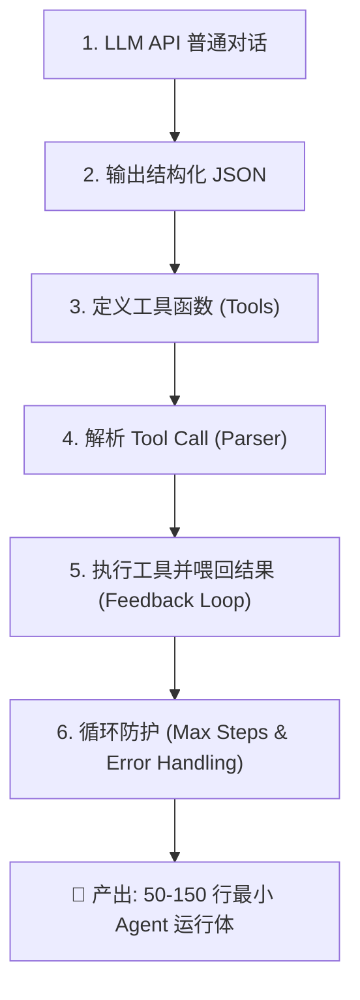

# 🎯 Stage 1: 构建最小 Agent Loop 通关指南与技术沉淀

> **学习目标**：掌握大模型基础对话、结构化 JSON 输出、工具函数定义、Tool Call 解析、反馈闭环以及 Agent Loop 死锁与异常防护。  
> **最终产出**：[Lab 01 最小 ReAct Agent (约 120 行核心代码)](file:///c:/Haven-AI/04-Projects/lab01_minimal_react/README.md)。

---

## ✅ Stage 1 技能清单全量对齐 CheckList (6/6 100% 完成)



| 序号 | Stage 1 技能要求 | 完成状态 | 源码 / 沉淀文档对应位置 | Java 后端开发视角对齐 |
| :--- | :--- | :--- | :--- | :--- |
| **1** | 会用一个 LLM API 完成普通对话 | ✅ **100% 完成** | [01-AI-and-LLM-Basics.md](file:///c:/Haven-AI/01-Fundamentals/01-AI-and-LLM-Basics.md) | 类似使用 OKHttp / RestTemplate 调用 REST 接口 |
| **2** | 会让模型输出结构化 JSON | ✅ **100% 完成** | [01-OpenAI-Function-Calling-Guide.md](file:///c:/Haven-AI/03-Frameworks-and-Tools/01-OpenAI-Function-Calling-Guide.md) | 相当于 Controller 强约束 `@ResponseBody` 返回 JSON DTO |
| **3** | 会定义一个工具函数 (`calculator`, `get_system_time` 等) | ✅ **100% 完成** | [lab01_minimal_react/tools.py](file:///c:/Haven-AI/04-Projects/lab01_minimal_react/tools.py) | 类似 Spring 定义 `@Service` Bean 方法与 `@Schema` 注解 |
| **4** | 会解析模型的 tool call / function call | ✅ **100% 完成** | [lab01_minimal_react/agent.py](file:///c:/Haven-AI/04-Projects/lab01_minimal_react/agent.py#L40-L75) | 类似 Jackson / Fastjson 将 JSON 字符串反序列化为 Command 对象 |
| **5** | 会执行工具，并把工具结果喂回模型 | ✅ **100% 完成** | [lab01_minimal_react/agent.py](file:///c:/Haven-AI/04-Projects/lab01_minimal_react/agent.py#L90-L135) | 类似 策略模式 (Strategy Pattern) + 回调机制 (Callback) |
| **6** | 会给 agent loop 加最大步数、超时和错误处理 | ✅ **100% 完成** | [lab01_minimal_react/agent.py](file:///c:/Haven-AI/04-Projects/lab01_minimal_react/agent.py#L125-L150) | 类似 Sentinel / Resilience4j 的熔断器、超时与死循环防护 |

---

## 🧩 核心技能代码片段与最佳实践沉淀

### 1. 用 LLM API 完成对话与结构化 JSON 输出
```python
import json
from openai import OpenAI

client = OpenAI()

# 强制模型输出 JSON 格式
response = client.chat.completions.create(
    model="gpt-4o-mini",
    response_format={"type": "json_object"},  # 强约束 JSON 响应
    messages=[
        {"role": "system", "content": "你是一个助手，请务必返回 JSON 格式: {\"answer\": \"...\"}"},
        {"role": "user", "content": "请介绍一下什么是 Agent"}
    ]
)
result_json = json.loads(response.choices[0].message.content)
print(result_json["answer"])
```

---

### 2. 定义工具注册表 (Tool Registry)
```python
# tools.py 中的工具集中管理
TOOL_REGISTRY = {
    "calculator": {
        "description": "执行数学运算，输入算术表达式字符串如 '2 + 2'",
        "func": lambda expr: str(eval(expr))
    },
    "get_system_time": {
        "description": "获取系统当前时刻",
        "func": lambda: datetime.now().strftime("%Y-%m-%d %H:%M:%S")
    }
}
```

---

### 3. 解析 Tool Call 核心正则与 DTO 转换
```python
import re
import json

def parse_action(llm_output: str):
    """从 LLM 吐出的文本中提取 Action 与 Action Input"""
    pattern = r"Action:\s*(\w+)\s*Action Input:\s*({.*}|.*)"
    match = re.search(pattern, llm_output, re.DOTALL)
    if match:
        action_name = match.group(1).strip()
        action_input = match.group(2).strip()
        return action_name, action_input
    return None, None
```

---

### 4. 具备死锁保护与错误处理的最小 Agent Loop
```python
def run_agent_loop(user_query: str, max_iterations: int = 5):
    """最小自主循环引擎"""
    messages = [{"role": "user", "content": user_query}]
    step = 0
    
    while step < max_iterations:  # 1. 防护一：最大步数上限
        step += 1
        print(f"\n--- [Loop 轮次 {step}/{max_iterations}] ---")
        
        # 2. 思考阶段
        llm_response = call_llm(messages)
        
        # 判定是否给出最终答案
        if "Final Answer:" in llm_response:
            return llm_response.split("Final Answer:")[1].strip()
            
        # 3. 解析与动作阶段
        action_name, action_input = parse_action(llm_response)
        if not action_name:
            # 格式错误容错机制
            messages.append({"role": "system", "content": "格式不符合要求，请务必按 Action: xxx Action Input: yyy 输出"})
            continue
            
        # 4. 执行阶段与异常防护
        try:
            tool_func = TOOL_REGISTRY[action_name]["func"]
            tool_output = tool_func(action_input)
        except Exception as e:  # 2. 防护二：工具执行报错捕获并喂回模型
            tool_output = f"工具执行报错: {str(e)}"
            
        # 5. 反馈阶段 (Observation -> Messages)
        messages.append({"role": "assistant", "content": llm_response})
        messages.append({"role": "user", "content": f"Observation: {tool_output}"})
        
    return "已达到最大尝试轮次限制，强行熔断停止。"
```

---

## 🏆 Stage 1 成果与技术要点总结

Lab 01 (`lab01_minimal_react`) 涵盖了构建最小 Agent 循环的核心要素：
1. **模块划分**：`tools.py`（工具注册与派发）、`agent.py`（控制循环与正则解析）、`main.py`（测试入口）。
2. **控制闭环**：基于 ReAct 模式实现 `Observe → Think → Act → Observe` 自主循环。
3. **鲁棒性控制**：内置 `max_iterations=5` 熔断机制与系统编码兼容。
4. **运行验证**：控制台输出完整的思考、决策与工具派发履约轨迹。

---

*归档路径：[c:\Haven-AI\04-Projects\lab01_minimal_react\01-Stage1-Checklist-Summary.md](file:///c:/Haven-AI/04-Projects/lab01_minimal_react/01-Stage1-Checklist-Summary.md)*
