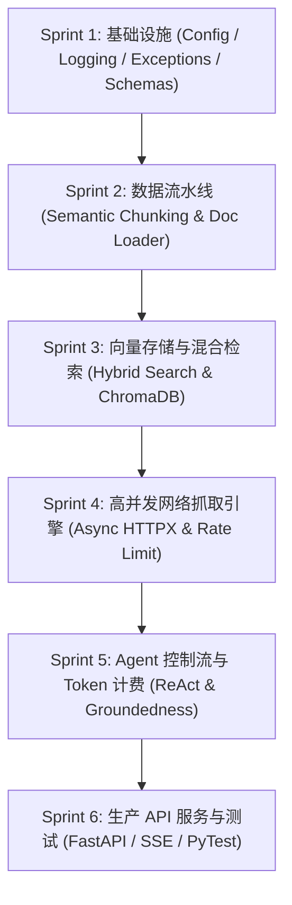

# 🏛️ HavenResearch Engine: 企业级深度研究 Agent 多 Iteration 敏捷开发计划

> **工程定位**：严格按照工业级软件工程规范，从基础设施、配置管理、异常体系、异步管道到测试覆盖，一步步慢慢打磨、深度迭代的生产级 Agent 引擎。

---

## 🗺️ 6 大 Sprint 渐进式迭代计划表

---

### 📌 Sprint 1: 基础设施与配置架构 (Infrastructure & Engineering Base)
* **核心产出**：
  - `config/settings.py`：基于 `pydantic-settings` 的强类型环境变量与配置管理。
  - `core/exceptions.py`：统一的企业级自定义异常体系 (BaseException, RetrieverException, VectorStoreException)。
  - `core/logger.py`：结构化 JSON 日志记录器与 TraceID 追踪。
  - `schemas/`：Pydantic DTO 接口契约定义。

### 📌 Sprint 2: 生产级数据提取与语义切片流水线 (Ingestion Pipeline)
* **核心产出**：
  - `ingestion/splitter.py`：实现带语义重叠与边界退避的 Recursive Text Splitter。
  - `ingestion/loaders.py`：生产级 PDF、Word、Markdown 统一解析器，具备解析失败优雅降级。
  - `ingestion/metadata.py`：自动抽取标题、页码、文档 Hash 值与时间戳。

### 📌 Sprint 3: 磁盘向量数据库与混合检索层 (Vector Store & Hybrid Search)
* **核心产出**：
  - `storage/vector_store.py`：`BaseVectorStore` 策略抽象与 ChromaDB 生产级封装（包含索引更新、删除、HNSW 距离度量）。
  - `storage/hybrid_retriever.py`：密(Vector)疏(BM25)混合检索机制实现。

### 📌 Sprint 4: 异步高并发网络检索与抓取调度器 (Web Scraper Engine)
* **核心产出**：
  - `retrievers/async_retriever.py`：基于 `httpx` 异步 HTTP 连接池的高并发检索器。
  - `scrapers/content_extractor.py`：带 Rate Limiting 速率控制与 User-Agent 动态轮询的 HTML 噪声去除引擎。

### 📌 Sprint 5: 核心 Agent 控制流与 Token 计费 (Agent Controller & Cost Engine)
* **核心产出**：
  - `agent/controller.py`：具有规划、子任务派发、结果反思与熔断保护的 Agent 控制器。
  - `agent/cost_tracker.py`：精确计算模型 Token 消耗与 API 费用。
  - `agent/citation_verifier.py`：引用 Groundedness 校验器，防出处伪造。

### 📌 Sprint 6: 生产 API 服务层与工程测试 (FastAPI & Engineering Tests)
* **核心产出**：
  - `api/v1/`：FastAPI 模块化路由与 SSE 流式推送。
  - `tests/`：PyTest 单元测试与集成测试覆盖。

---

*文件归档：[c:\Haven-AI\04-Projects\lab02_rag_agent\00-Production-Sprint-Plan.md](file:///c:/Haven-AI/04-Projects/lab02_rag_agent/00-Production-Sprint-Plan.md)*
