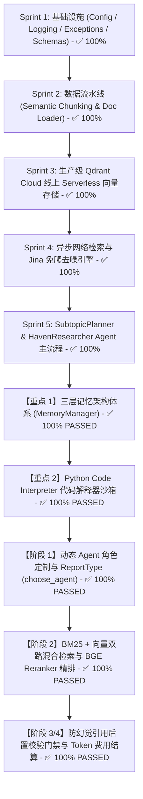

# 🏛️ HavenResearch Engine: 企业级深度研究 Agent 多 Iteration 敏捷开发计划

> **工程定位**：严格按照工业级软件工程规范，从基础设施、配置管理、异常体系、异步管道、三层记忆、代码解释器、动态 Persona、混合检索与重排序、防幻觉校验门禁到测试覆盖，一步步慢慢打磨、深度迭代的生产级 Agent 引擎。

---

## 🗺️ 研发阶段与进阶路线图



---

### 🧠 核心进阶研发计划 (Advanced Roadmap)

#### ✅ 【重点 1】三层记忆架构体系 (`haven_research/memory/`) - 【100% PASSED】
- `haven_research/memory/working.py`: `WorkingMemory` (单任务暂存 Scratchpad)
- `haven_research/memory/session.py`: `SessionMemory` (多轮对话滑动窗口 + DeepSeek LLM 自动摘要压缩)
- `haven_research/memory/long_term.py`: `LongTermMemory` (Qdrant Cloud 云端长期偏好与历史报告索引)
- `haven_research/memory/manager.py`: `MemoryManager` 统一门禁调度控制中心

#### ✅ 【重点 2】Python Code Interpreter (代码解释器工具) - 【100% PASSED】
- `haven_research/interpreter/sandbox.py`: `PythonSandbox` (隔离沙箱，捕获控制台 stdout/stderr & 超时控制)
- `haven_research/interpreter/tool.py`: `CodeInterpreterTool` (解析 ```python ``` 代码块，运行精确计算与 Matplotlib 绘图)

#### ✅ 【阶段 1】动态 Agent 角色定制与多模式报告 (`haven_research/actions/`) - 【100% PASSED】
- `haven_research/actions/agent_creator.py`: `choose_agent` (1:1 对标 gpt-researcher 自动生成专家 Persona)
- `haven_research/schemas/dto.py`: 增加 `ReportType` 与 `ReportSource` 枚举说明

#### ✅ 【阶段 2】双路混合检索与 BGE Reranker 精排 (`haven_research/reranker/`) - 【100% PASSED】
- `haven_research/reranker/bge_reranker.py`: `BGEReranker` (向量余弦得分与 BM25 词频匹配交叉碰撞二次重新打分)
- `haven_research/reranker/hybrid.py`: `HybridRetriever` (双路召回 Top 15，Cross-Encoder 精选 Top 5)

#### ✅ 【阶段 3/4】防幻觉引用后置校验门禁与 Token 费用结算 (`verifier/` & `utils/`) - 【100% PASSED】
- `haven_research/verifier/verifier.py`: `CitationVerifierGate` (抽查 Statement-Citation 断言对，自检蕴含关系消除假引用)
- `haven_research/utils/costs.py`: `CostTracker` (1:1 对标 gpt-researcher 精确计算 Prompt/Completion Token 与美元费用)
