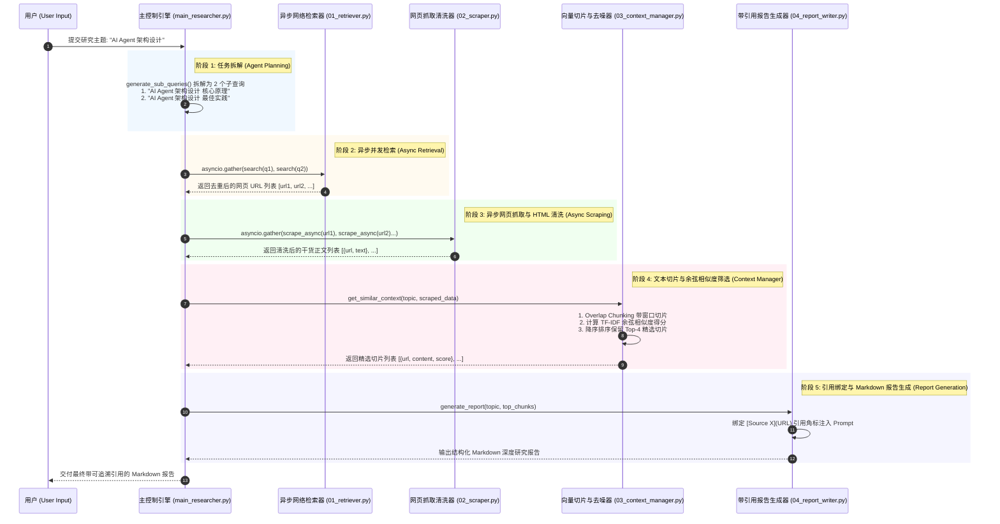

# 🚀 Stage 2: 企业级 RAG 与资料研究助手 (Deep Research Agent) 架构与工程链路指南

> **核心目标**：构建符合企业级生产标准的 RAG 系统与多工具协同的 Deep Research Agent。

---

## 🏗️ 一、 深度研究 Agent 全景工程时序图 (Mermaid Pipeline)

---

## 📦 二、 阶段间的数据流转契约 (Data Contracts)

| 阶段 | 执行模块 | 接收输入格式 (Input) | 转换/处理动作 | 输出数据结构 (Output) |
| :--- | :--- | :--- | :--- | :--- |
| **1. 任务拆解** | `main_researcher.py` | `"AI Agent 架构设计"` (`str`) | 大目标拆解为子搜索关键词 | `["AI Agent 架构设计 核心原理", "AI Agent 架构设计 最佳实践"]` (`List[str]`) |
| **2. 并发检索** | `01_retriever.py` | 2 个搜索关键词 (`List[str]`) | 使用 `asyncio` 并发调用 DuckDuckGo 搜索 | `["https://openai.com/...", "https://docs.anthropic.com/..."]` (`List[str]`) |
| **3. 网页抓取** | `02_scraper.py` | URL 链接列表 (`List[str]`) | 使用 `requests` + `BeautifulSoup` 过滤 `<script>`、`<nav>` 等标签 | `[{"url": "...", "text": "提取的干货正文..."}, ...]` (`List[Dict]`) |
| **4. 切片与去噪**| `03_context_manager.py` | 抓取网页文本列表 (`List[Dict]`) | 窗口重叠切片 (Chunking)，计算余弦相似度 (Cosine Similarity) 提纯 | `[{"url": "...", "content": "切片段落...", "score": 0.617}, ...]` (`List[Dict]`) |
| **5. 报告生成** | `04_report_writer.py` | 保留的 Top-4 核心切片 (`List[Dict]`) | 绑定 `[Source X](URL)` 角标注入 Prompt | 格式化的 Markdown 深度研究报告字符串 (`str`) |

---

## 🗺️ 三、 生产级扩展演进方向

在当前核心主管道闭环的基础上，可按需补充以下 6 大模块：

1. **磁盘持久化向量库 (Vector Store)**：集成 ChromaDB / FAISS 向量库与真实 Embedding 模型。
2. **多源搜索引擎适配 (Multi-Source Retrievers)**：接入 Tavily, SearXNG, Arxiv API。
3. **重排精筛 (Cross-Encoder Reranker)**：集成 `bge-reranker-large` 模型消除二次假相关切片。
4. **多格式本地文档解析 (Document Loaders)**：集成 `PyPDF`、`python-docx`、`pandas`。
5. **FastAPI 与 WebSocket 流式控制台 (Streaming UI)**：支持前端可视化进度推送。
6. **MCP 协议与自定义 Skill 插件**：挂载 MCP 服务节点。

---

*文件归档：[c:\Haven-AI\04-Projects\lab02_rag_agent\00-Stage2-Roadmap-and-Architecture.md](file:///c:/Haven-AI/04-Projects/lab02_rag_agent/00-Stage2-Roadmap-and-Architecture.md)*
