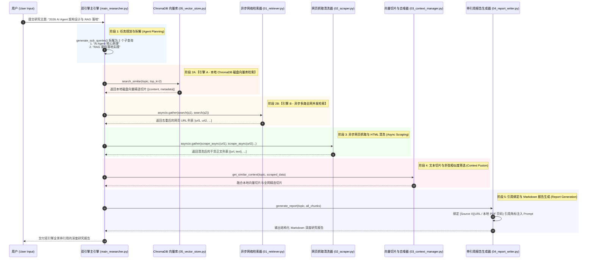

# 💻 Lab 02: 资料研究助手 (Deep Research Agent) 全景生产级架构与源码指南

> **对标标杆**：开源深度研究 Agent 框架 [assafelovic/gpt-researcher](https://github.com/assafelovic/gpt-researcher)  
> **生产级架构**：基于纯 Python + ChromaDB 磁盘向量数据库 + FastAPI，构建包含**私有本地 PDF/Markdown 知识库 + 全网实时检索**双引擎协同的工业级 Deep Research Agent。

---

## 🔄 一、 深度研究 Agent 双引擎全景工程链路 (Engineering Pipeline)



---

## ✅ 二、 Lab 02 生产级 Python 源码全量清单 (7/7 100% 落地)

| 模块文件名 | 功能职责 | 技术选型与数据流 | 核心源码链接 |
| :--- | :--- | :--- | :--- |
| **01_retriever.py** | 异步网络检索器 (支持 DuckDuckGo 真实搜索) | Python `asyncio` + `duckduckgo_search` | [01_retriever.py](file:///c:/Haven-AI/04-Projects/lab02_rag_agent/01_retriever.py) |
| **02_scraper.py** | 网页抓取与 HTML 文本噪声清洗器 | `requests` + `BeautifulSoup4` | [02_scraper.py](file:///c:/Haven-AI/04-Projects/lab02_rag_agent/02_scraper.py) |
| **03_context_manager.py** | 向量切片 (Overlap Chunking) 与余弦相似度去噪 | TF-IDF + Cosine Similarity | [03_context_manager.py](file:///c:/Haven-AI/04-Projects/lab02_rag_agent/03_context_manager.py) |
| **04_report_writer.py** | 强引用约束 Markdown 报告生成器 | 模版化 Prompt 绑定 `[Source X](URL/页码)` | [04_report_writer.py](file:///c:/Haven-AI/04-Projects/lab02_rag_agent/04_report_writer.py) |
| **05_vector_store.py** | **ChromaDB 磁盘持久化向量数据库引擎** | `chromadb.PersistentClient` (384维 ONNX Vector) | [05_vector_store.py](file:///c:/Haven-AI/04-Projects/lab02_rag_agent/05_vector_store.py) |
| **06_doc_loader.py** | **本地多格式文档 (PDF/MD/TXT) 提取与向量入库引擎** | `pypdf` + 自动元数据提取 (`file_name`, `page`) | [06_doc_loader.py](file:///c:/Haven-AI/04-Projects/lab02_rag_agent/06_doc_loader.py) |
| **07_fastapi_server.py**| **生产级 FastAPI REST API & WebSocket 流式服务端** | FastAPI + Uvicorn + WebSocket + CORS | [07_fastapi_server.py](file:///c:/Haven-AI/04-Projects/lab02_rag_agent/07_fastapi_server.py) |
| **main_researcher.py** | **双引擎 Deep Research Agent 主指挥官引擎** | 整合本地 Chroma 向量库与全网搜索并发调度 | [main_researcher.py](file:///c:/Haven-AI/04-Projects/lab02_rag_agent/main_researcher.py) |

---

## 🚀 三、 极简运行与测试方式

在本工程的 Python 虚拟环境中，支持命令行与 Web API 服务两种运行模式：

### 1. 命令行直接执行双引擎研究 Agent：
```bash
c:\Haven-AI\.venv\Scripts\python.exe c:\Haven-AI\04-Projects\lab02_rag_agent\main_researcher.py
```

### 2. 启动生产级 FastAPI Web 服务 (http://127.0.0.1:8000)：
```bash
c:\Haven-AI\.venv\Scripts\python.exe c:\Haven-AI\04-Projects\lab02_rag_agent\07_fastapi_server.py
```

---

*文件归档：[c:\Haven-AI\04-Projects\lab02_rag_agent\README.md](file:///c:/Haven-AI/04-Projects\lab02_rag_agent\README.md)*
