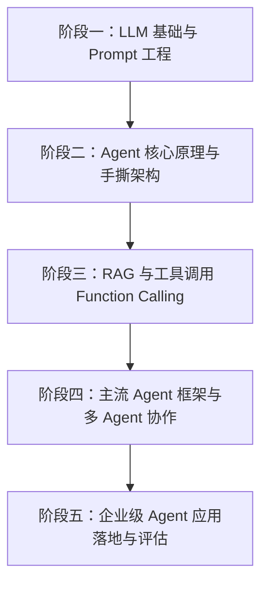

# 🧠 Haven-AI 知识库与 Agent 学习路线图

欢迎来到 **Haven-AI**！这是一个系统化构建的 **AI & AI Agent 知识库**。本知识库不仅记录大语言模型（LLM）与智能体（Agent）的核心概念、架构原理，还将包含框架实战、代码项目、疑难排查与优质资源。

---

## 📂 知识库目录结构

- 📖 [**01-Fundamentals (基础概念)**](file:///c:/Haven-AI/01-Fundamentals/01-AI-and-LLM-Basics.md)
  - LLM 基础、Token、上下文窗口、Embedding、向量数据库、Prompt 工程等。
- 🏗️ [**02-Agent-Architecture (Agent 核心架构)**](file:///c:/Haven-AI/02-Agent-Architecture/01-What-is-an-Agent.md)
  - Agent 四大支柱、[Chatbot / Workflow / Agent / Multi-Agent 核心区别对比](file:///c:/Haven-AI/02-Agent-Architecture/02-Chatbot-vs-Workflow-vs-Agent-vs-MultiAgent.md)、[O-T-A-O 核心自主循环](file:///c:/Haven-AI/02-Agent-Architecture/03-Agent-Basic-Loop-Observe-Think-Act.md)、[什么时候不该用 Agent](file:///c:/Haven-AI/02-Agent-Architecture/04-When-NOT-to-use-an-Agent.md)、[Anthropic 官方指南](file:///c:/Haven-AI/02-Agent-Architecture/05-Anthropic-Building-Effective-Agents.md)、[OpenAI 官方白皮书](file:///c:/Haven-AI/02-Agent-Architecture/06-OpenAI-Practical-Guide-to-Building-Agents.md)、[短笔记：为什么需要 Agent 而不是 Workflow](file:///c:/Haven-AI/02-Agent-Architecture/07-Short-Note-Why-Agent-Over-Workflow.md)。
- 🛠️ [**03-Frameworks-and-Tools (主流框架与工具)**](file:///c:/Haven-AI/03-Frameworks-and-Tools/README.md)
  - LangChain, LlamaIndex, AutoGen, CrewAI, MCP (Model Context Protocol) 及 Tool/API 集成。
- 💻 [**04-Projects (实战项目与代码仓库)**](file:///c:/Haven-AI/04-Projects/README.md)
  - 从零手写 ReAct Agent、RAG 知识库系统、多 Agent 协作系统等练习 labs。
- ❓ [**05-FAQ-and-Troubleshooting (问题总结与踩坑记录)**](file:///c:/Haven-AI/05-FAQ-and-Troubleshooting/README.md)
  - 开发过程中的报错、性能调优、常见问题答疑库。
- 📚 [**06-Resources (论文与优质资源)**](file:///c:/Haven-AI/06-Resources/README.md)
  - Agent 经典必读论文（ReAct, Toolformer, Reflexion 等）、官方文档与开源项目清单。

---

## 🗺️ AI Agent 学习路线图 (Roadmap)

### 📍 阶段一：LLM 基础与 Prompt 工程
* **目标**：深刻理解 LLM 的输入输出原理、能力边界与控制方式。
* **核心内容**：
  - Token、Context Window、Temperature / Top-P 采样参数。
  - System Prompt 设计、Few-Shot 提示词、Chain-of-Thought (CoT) 思维链。
  - Structured Output（JSON Mode / Function Calling 规范）。

### 📍 阶段二：Agent 核心原理与手撕架构
* **目标**：不依赖框架，从 0 到 1 用纯代码实现智能体循环。
* **核心内容**：
  - 什么是 Agent？（Agent = LLM + Observation + Thought + Action + Loop）
  - 规划机制：ReAct (Reason + Act)、Plan-and-Solve、Reflexion (反思)。
  - 记忆系统：短期记忆（Context Window）、长期记忆（Vector Store / Key-Value）。
  - 手写第一个 ReAct 循环脚本。

### 📍 阶段三：RAG 与工具调用 (Tool Use)
* **目标**：打破 LLM 的静态知识限制，使其能联网、查数据库、检索私有文档。
* **核心内容**：
  - RAG 原理：Chunking、Embedding、Vector Database (Chroma, Qdrant)、Rerank。
  - Tool / Function Calling 原理： Schema 定义、参数解析、错误重试。
  - Model Context Protocol (MCP) 标准协议。

### 📍 阶段四：主流 Agent 框架与多 Agent 协作
* **目标**：熟练运用工程化框架快速搭建复杂的应用系统。
* **核心内容**：
  - LangChain / LangGraph：基于图（Graph）的灵活状态控制。
  - AutoGen & CrewAI：多 Agent 角色扮演与组队协同。
  - LlamaIndex：面向数据检索的 Agent 解决方案。

### 📍 阶段五：企业级 Agent 评估、部署与优化
* **目标**：解决真实生产环境中的稳定性、时延与成本控制问题。
* **核心内容**：
  - Agent 评估（Evaluation）：Ragas、AgentBench、LLM-as-a-Judge。
  - 容错与幻觉控制：Guardrails、Fallback 策略、人机协同（Human-in-the-loop）。
  - 异步任务与性能调优。

---

*知识库维护说明：本知识库由 AI Agent 导师协同更新，跟随您的学习进度持续补充细节与代码实例。*
